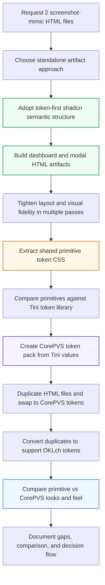

# Visual Stress-Test Flow

- Request 2 HTML files that mimic screenshots
  - Choose standalone artifact HTML approach
  - Use token-first shadcn semantic structure
  - Build dashboard and modal mockups
  - Tighten visual fidelity in several passes
  - Extract shared primitive token CSS
  - Compare primitives against Tini token library
  - Create CorePVS token pack from Tini values
  - Duplicate HTML files and swap to CorePVS tokens
  - Convert duplicates to support OKLch tokens
  - Compare primitive vs CorePVS look and feel
  - Document gaps, comparison, and flow

