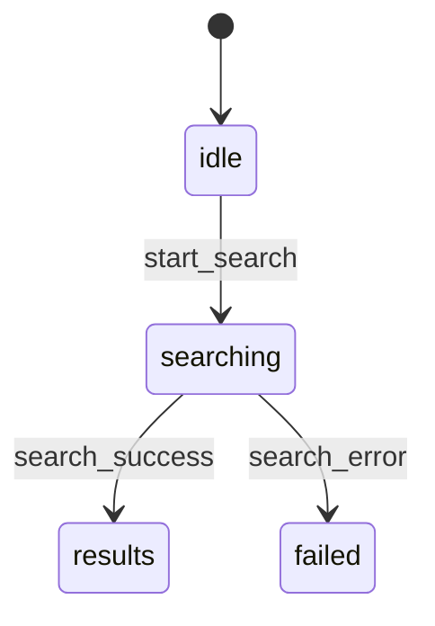

# Code to Rule Patterns

## Overall Flow (AI-Ready)

```
Code / Flow reality
   ↓ (Extract)
Layer 2 – Interaction Contract
   ↓ (Reflect)
Layer 3 – UI Intent
   ↓ (Crystallize)
Design System Rules & Patterns
```

---

```
Layer 2 – Interaction Contract (Narrative, human-readable)

        ↓ formalize

Layer 2.5 – State Machine (Exact, deterministic)

        ↓ informed by

Layer 3 – UI Intent (Experience rules)
```

---

Each step has:
* **Prompt**
* **Content Structure template**
* **Clear output to feed into the next step**

---

## How to Derive State Machine from Layer 2

You are a state machine architect.

**Input:** Layer 2 – Interaction Contract (narrative flow) OR Existing codes of the application.

**Task:** Convert it into a deterministic state machine.

**Rules:**
* Do NOT add new product rules or steps that aren't in Layer 2.
* Every step in Happy Path must map to: (state) --event--> (state).
* Capture alternate/failure paths as explicit error or recovery states.
* If Layer 2 is ambiguous, keep the transition but set certainty=INFERRED and add it to Open Questions.
* Use consistent naming: verbs for events (e.g., submit_form), nouns/adjectives for states (e.g., loading, slot_selected).
* Output in TWO formats:

### A) Mermaid State Diagram



### B) YAML State Machine Spec

```yaml
initial_state: idle

states:
  - idle
  - searching
  - results
  - failed

events:
  - start_search
  - search_success
  - search_error

transitions:
  - from: idle
    to: searching
    on: start_search
    guards: []
    side_effects: []
    certainty: EXPLICIT
```

---

# Step 1 — Extract

## AI Prompt: Interaction Extractor

You are a design-aware interaction analyst.

**Goal:** Extract the Interaction Contract (Layer 2) from the provided code or flow.

**Rules:**
* Describe interactions in plain language first, not technical jargon.
* Do NOT invent flows or UX decisions not evidenced in the code.
* If behavior is implied, mark it as INFERRED.
* If unclear, mark as UNKNOWN.
* Focus on user-visible behavior and system decisions.
* Output must follow the provided Layer 2 template exactly.

This document will be read by designers first, developers second.

---

## Layer 2 — Content Structure Template

*(Design-first, dev-readable)*

### Feature / Flow Name

### Purpose of This Flow
Why this interaction exists from user perspective.

### Entry Points
Where the user can start this flow.

### Happy Path (Primary Interaction Narrative)
Describe the ideal flow step-by-step.

**Step 1:**
* User intent:
* User action:
* System decision:
* What user sees:

**Step 2:**
...

### System States (Implicit & Explicit)

| State name | Meaning (human language) | User aware? |
|------------|--------------------------|-------------|

### Decision Rules

| Situation | System rule | Outcome |
|-----------|-------------|---------|

### Alternate & Failure Paths
For each:
* Trigger
* System behavior
* User experience
* Recovery option

### Completion & Exit
* When is the flow considered complete?
* What data/state is saved?
* Where does the user go next?

### Unclear / Risky Areas
* Things the code does but UX intent is unclear

---

### ✅ Step 1 Output Used For:

* Review flow with designer
* Spot UX smell
* Feed into Layer 3

---

# Step 2 — Reflect

## AI Prompt: UI Intent Reflector

You are a senior product designer.

Using the Interaction Contract (Layer 2) below, extract the UI Intent (Layer 3).

**Rules:**
* Focus on experience principles, not components.
* Express intent as repeatable rules.
* Avoid visual styling details.
* If intent is inconsistent across steps, call it out.
* This document must be reusable across multiple features.

Output must follow the provided Layer 3 template exactly.

---

## Layer 3 — Content Structure Template

*(Experience-first, system-ready)*

### Experience Goal
What the user should feel throughout this flow.

### Core Screens / Moments

| Moment | User mindset | System responsibility |
|--------|-------------|------------------------|

### Action Hierarchy
Rules about actions across the flow:
* What is always primary?
* When secondary actions appear?
* When actions must be disabled?

### Feedback Philosophy
How the system communicates state changes:
* Loading:
* Success:
* Failure:
* Waiting / pending:

### Error Handling Intent
* Default error style:
* Blocking vs non-blocking:
* Recovery expectation:

### Progress & Control
* How user knows where they are
* Can user go back or cancel?
* Is any state irreversible?

### Accessibility & Cognitive Load
* Interaction density
* One-hand / mobile assumptions
* Reading complexity

### Experience Anti-patterns (Observed)
Things this flow intentionally avoids or accidentally causes.

---

### ✅ Step 2 Output Used For:

* Align designer
* Compare multiple flows
* Prepare for Design System

---

# Step 3 — Crystallize

## AI Prompt: Design System Crystallizer

You are a design system architect.

Using the provided UI Intent (Layer 3), extract reusable Design System rules and patterns.

**Rules:**
* Only create patterns that can apply to multiple flows.
* Each pattern must be justified by repeated intent.
* Write rules in human language, not component specs.
* Clearly state when the pattern should and should not be used.

Output must follow the provided Design System template exactly.

---

## Design System — Content Structure Template

### Pattern Name
Human-readable, behavior-based.

### Problem This Pattern Solves
What user/system tension it addresses.

### When to Use
Situations where this pattern applies.

### When NOT to Use
Clear exclusions.

### Core UX Rules
Non-negotiable rules (must / must not).

### Required User Signals
What user must always see or be able to do.

### System Responsibilities
What the system must guarantee.

### Related Patterns
Dependencies or alternatives.

### Origin
Derived from:
* Feature / Flow name(s)
* Date
