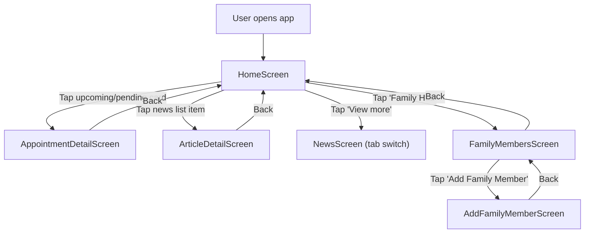

# Home — Design Document

## 1. Context

**Change request:** Initial Home flow design for jelvo Proto
**Scope:** Home tab flow — `HomeScreen` + all screens reachable from it (`AppointmentDetailScreen`, `ArticleDetailScreen`, `FamilyMembersScreen`, `AddFamilyMemberScreen`)
**Related docs:** `docs/_ngan-ptn/home-v2.md` (previous version, code-extracted spec)

---

## 2. Goals

- Provide a "day-start" dashboard so users orient quickly on their health agenda
- Surface the most urgent information first (next appointment, pending requests) to reduce cognitive load
- Offer low-friction entry points to family management and health content without overwhelming the primary view
- Maintain calm, trustworthy tone appropriate for healthcare context

---

## 3. Design Summary

### 3.1 Screen List & Navigation

| Screen | Type | Entry |
|--------|------|-------|
| `HomeScreen` | Tab root | Bottom tab `home` |
| `AppointmentDetailScreen` | Detail | From `HomeScreen` (upcoming hero CTA or pending card) |
| `ArticleDetailScreen` | Detail | From `HomeScreen` (news list item) |
| `FamilyMembersScreen` | Detail | From `HomeScreen` (header "Family Hub") |
| `AddFamilyMemberScreen` | Detail | From `FamilyMembersScreen` (CTA or header +) |



### 3.2 Key Interactions

- **Upcoming hero card tap**: "Get Directions" button or phone icon navigates to `AppointmentDetailScreen` for the selected appointment
- **Pending card stack**: Swipeable card stack with pager dots; tapping a card navigates to `AppointmentDetailScreen`
- **Quick Book tiles**: Entry points for booking (Fast-lane, Specialty, Doctor) — visual-only, not interactive
- **News list**: Tapping an article navigates to `ArticleDetailScreen`; "View more" switches to the News tab
- **Family Hub**: Header action navigates to `FamilyMembersScreen`

### 3.3 Visual Specs

No custom color systems or dot mappings for this flow. Uses standard jelvo brand tokens.

**Visual guidelines:** `docs/guidelines/`

---

## 4. Screen Details

### 4.1 Screen: HomeScreen

#### Purpose

Provide a "day-start" dashboard: next confirmed appointment, pending requests, quick booking entry points, and latest health news.

#### Wireframe

```text
+------------------------------------------------------+
| [Avatar] [Greeting] [User name]       [Family Hub]   |  <- Header (sticky)
+------------------------------------------------------+
| [Status pill] [Icon]                                  |  <- Upcoming Appointment Hero Card
| [Doctor name]                                         |    (conditional: nearest confirmed)
| [Specialty]                                           |
| [Date/time]                                           |
| [Location]                                            |
| [Button: Get Directions] [Icon button: Phone]         |
|                                                       |
| [Tile: Fast-lane] [Tile: Specialty] [Tile: Doctor]    |  <- Quick Book
|                                                       |
| [CardStackWithPager]                                  |  <- Pending (conditional)
|   [AppointmentListCard] x N                           |
|   [Pager dots] (if N > 1)                             |
|                                                       |
| [ArticleListItemCard] x 3                             |  <- Latest Health News
| [Button: View more]                                   |
+------------------------------------------------------+
| Home / News / Appointments / Notification / Profile   |  <- BottomTabBar (fixed)
+------------------------------------------------------+
```

#### Emotional Tone

Calm, supportive, organized — the screen should feel like a personal health assistant greeting the user.

#### Information Hierarchy

1. **Primary:** Next confirmed appointment (hero card) — the most time-sensitive information
2. **Secondary:** Pending appointment requests — status awareness for in-progress bookings
3. **Tertiary:** Quick book tiles, latest health news — low-urgency, exploratory content

#### Screen-Level Flow (Narrative)

1. User opens app -> lands on Home tab
2. User sees greeting with their name and the upcoming appointment hero card (if a confirmed appointment exists)
3. User can tap "Get Directions" on the hero card -> navigates to `AppointmentDetailScreen`
4. User can tap the phone icon on the hero card -> navigates to `AppointmentDetailScreen`
5. Below the hero card, user sees Quick Book tiles (visual-only, not interactive)
6. If pending appointments exist, user sees a swipeable card stack with pager dots
7. User can tap a pending card -> navigates to `AppointmentDetailScreen`
8. User scrolls to Latest Health News section showing 3 article cards
9. User can tap an article -> navigates to `ArticleDetailScreen`
10. User can tap "View more" -> switches to News tab
11. User can tap "Family Hub" in header -> navigates to `FamilyMembersScreen`

Alternate paths:
- No confirmed appointment -> hero card section is not rendered
- No pending appointments (matching / await_confirm) -> pending section is not rendered
- News list always shows articles; "View more" navigates to News tab

#### Element States

| Region / Element | State | Condition | UI / Behavior |
|------------------|-------|-----------|---------------|
| `Header` | Default | Always | Avatar + greeting + user name + "Family Hub" action |
| `Upcoming Appointment Hero Card` | Default | Nearest `confirmed` appointment exists | Hero card with status pill, doctor, specialty, date/time, location, "Get Directions" button, phone icon |
| | Empty | No `confirmed` appointment exists | Section not rendered |
| `Quick Book` | Default | Always | Three tiles rendered (Fast-lane, Specialty, Doctor) — visual-only |
| `Pending` | Default | Pending items exist (`matching` / `await_confirm`) | Card stack with swipeable cards |
| | Empty | No pending items | Section not rendered |
| `Pending > Pager dots` | Default | N > 1 pending items | Pager dots visible below card stack |
| | Hidden | N = 1 | Pager dots not rendered |
| `Latest Health News` | Default | Articles available | 3 article list item cards + "View more" button |
| | Empty | No articles | Section not rendered |
| `BottomTabBar` | Default | Always | Visible and interactive, `home` tab highlighted |

---

### 4.2 Screen: AppointmentDetailScreen

#### Purpose

Show a single appointment's status-driven messaging, details, and primary next action.

#### Wireframe

```text
+------------------------------------------------------+
| [Back] [Title] [Subtitle]                             |  <- DetailHeader (sticky)
+------------------------------------------------------+
| [Status hero icon/illustration]                       |  <- Status Hero
| [Status title]                                        |
| [Status description]                                  |
|                                                       |
| [MatchingProgress]                                    |  <- Matching Progress
|                                                       |    (matching only)
| [AppointmentInfoCard]                                 |  <- Appointment Info Card
|   [Doctor] [Date/time] [Location] [Last updated]      |    (most statuses)
|                                                       |
| [MatchingPlaceholderCard]                             |  <- Matching Placeholder
|                                                       |    (matching only)
| [UpdatedChanges]                                      |  <- Updated Changes
|                                                       |    (modified_by_practice only)
| [Reason card]                                         |  <- Reason Card
|                                                       |    (cancelled_doctor only)
| [Feedback card]                                       |  <- Feedback Card
|   [Rating] [Comment]                                  |    (completed only)
|                                                       |
| [Button: Add to Calendar]                             |  <- Top Actions
| [Button: Export .ics] [Button: Get Directions]        |    (confirmed only)
+------------------------------------------------------+
| [Primary action button]                               |  <- PageBottomBar (fixed)
+------------------------------------------------------+
```

#### Emotional Tone

Reassuring, professional — the user should feel informed about their appointment status and confident about next steps.

#### Information Hierarchy

1. **Primary:** Status hero — immediately communicates where the appointment stands
2. **Secondary:** Appointment details (doctor, date, time, location) — the key facts
3. **Tertiary:** Status-specific actions and cards (calendar, feedback, changes)

#### Screen-Level Flow (Narrative)

1. User arrives from `HomeScreen` (tapping upcoming hero or pending card) with a specific appointment selected
2. User sees status hero with title and description matching the appointment's current status
3. If status is `matching`, user sees matching progress animation and a placeholder card
4. If status is `confirmed` or similar, user sees appointment info card with doctor/date/time/location
5. If status is `modified_by_practice`, user sees "What was updated" changes card
6. If status is `cancelled_doctor`, user sees reason card with decline explanation
7. If status is `completed`, user sees feedback card (rating + comment)
8. If status is `confirmed`, user sees top action buttons (Add to Calendar, Export .ics, Get Directions)
9. User sees a primary action button at the bottom (label/variant depends on status)
10. User can tap Back -> navigates to `HomeScreen`

Alternate paths:
- Invalid or missing `appointmentId` -> screen renders nothing (fallback)

#### Element States

| Region / Element | State | Condition | UI / Behavior |
|------------------|-------|-----------|---------------|
| `DetailHeader` | Default | Always | Back button visible; title/subtitle optional |
| `Status Hero` | Default | Appointment found | Icon/illustration + title + description; content depends on `status` |
| | Error | Invalid/missing `appointmentId` | Nothing rendered |
| `Matching Progress` | Default | `status = matching` | Animated step indicators visible |
| | Hidden | Any other status | Not rendered |
| `Appointment Info Card` | Default | `status` in (`await_confirm`, `confirmed`, `modified_by_practice`, `completed`, `cancelled_patient`, `cancelled_doctor`) | Doctor, date/time, location, last updated |
| | Hidden | `status = matching` | Not rendered (placeholder shown instead) |
| `Matching Placeholder` | Default | `status = matching` | Skeleton-style placeholder card |
| | Hidden | Any other status | Not rendered |
| `Updated Changes` | Default | `status = modified_by_practice` | "What was updated" card with change details |
| | Hidden | Any other status | Not rendered |
| `Reason Card` | Default | `status = cancelled_doctor` | Decline reason card |
| | Hidden | Any other status | Not rendered |
| `Feedback Card` | Default | `status = completed` | Rating + comment UI |
| | Hidden | Any other status | Not rendered |
| `Top Actions` | Default | `status = confirmed` | Add to Calendar, Export .ics, Get Directions buttons |
| | Hidden | Any other status | Not rendered |
| `PageBottomBar` | Default | Always | Primary action button; label and variant depend on `status` |

---

### 4.3 Screen: ArticleDetailScreen

#### Purpose

Let users read a selected article in a block-based detail layout (text, image, chart, video blocks).

#### Wireframe

```text
+------------------------------------------------------+
| [Back] [Title] [Published date]                       |  <- DetailHeader (sticky)
+------------------------------------------------------+
| [Text block]                                          |  <- Article Blocks (card-based)
| [Image block + caption]                               |    Block types: text, image,
| [Chart block]                                         |    chart, video
| [Video block]                                         |
| ...                                                   |
+------------------------------------------------------+
```

#### Emotional Tone

Informative, calm — a reading experience that respects the user's attention without distractions.

#### Information Hierarchy

1. **Primary:** Article title and content blocks — the reading experience
2. **Secondary:** Published date — temporal context
3. **Tertiary:** Navigation (back button) — orientation

#### Screen-Level Flow (Narrative)

1. User arrives from `HomeScreen` (tapping a news list item) with a specific article selected
2. User sees article title and published date in header
3. User scrolls through content blocks (text, images, charts, video links)
4. User can tap Back -> navigates to `HomeScreen`

Alternate paths:
- Invalid or missing `articleId` -> screen renders nothing (fallback)

#### Element States

| Region / Element | State | Condition | UI / Behavior |
|------------------|-------|-----------|---------------|
| `DetailHeader` | Default | Always | Back button + article title + published date |
| `Text blocks` | Default | `block.type = text` | Paragraphs rendered |
| `Image blocks` | Default | `block.type = image` | Image displayed + optional caption |
| `Chart blocks` | Default | `block.type = chart` | Chart rendered |
| `Video blocks` | Default | `block.type = video` | Link that opens in a new tab |
| `Article Blocks` (overall) | Default | Valid `articleId` | Blocks rendered in order |
| | Error | Invalid/missing `articleId` | Nothing rendered |

---

### 4.4 Screen: FamilyMembersScreen

#### Purpose

Enable users to manage family profiles used for booking appointments on behalf of others.

#### Wireframe

```text
+------------------------------------------------------+
| [Back] [Title] [Subtitle]                     [+]    |  <- DetailHeader (sticky)
+------------------------------------------------------+
| [Icon/illustration]                                   |  <- Empty State
| [Title: No family members]                            |    (when no members)
| [Supporting copy]                                     |
| [Button: Add Family Member]                           |
+------------------------------------------------------+
```

#### Emotional Tone

Supportive, encouraging — the empty state should motivate users to add family members rather than feel like a dead end.

#### Information Hierarchy

1. **Primary:** Family member list (or empty state message if none)
2. **Secondary:** Add action — clear CTA to create a new member
3. **Tertiary:** Header navigation (back, add shortcut)

#### Screen-Level Flow (Narrative)

1. User arrives from `HomeScreen` (tapping "Family Hub" in header)
2. If no family members exist, user sees empty state with illustration, message, and "Add Family Member" CTA
3. User can tap "Add Family Member" CTA or header (+) -> navigates to `AddFamilyMemberScreen`
4. If family members exist, user sees a list of member cards
5. User can tap Back -> navigates to `HomeScreen`

Alternate paths:
- No family members -> empty state UI shown
- Family members exist -> list UI shown

#### Element States

| Region / Element | State | Condition | UI / Behavior |
|------------------|-------|-----------|---------------|
| `DetailHeader` | Default | Always | Back button + title/subtitle + add shortcut (+) |
| `Empty State` | Default | No family members | Illustration + title + supporting copy + "Add Family Member" CTA |
| | Hidden | Family members exist | Not rendered |
| `Family List` | Default | Family members exist | List of member rows/cards |
| | Hidden | No family members | Not rendered |
| `Add action` | Default | Always | Tap CTA or (+) navigates to `AddFamilyMemberScreen` |

---

### 4.5 Screen: AddFamilyMemberScreen

#### Purpose

Collect basic family member information required to book appointments on their behalf.

#### Wireframe

```text
+------------------------------------------------------+
| [Back] [Title] [Subtitle]                             |  <- DetailHeader (sticky)
+------------------------------------------------------+
| [Input: Full Name*]                                   |  <- Form
| [Input: Date of Birth*] [Icon: calendar]              |
| [Relationship*]                                       |
|   [Option] [Option]                                   |
|   [Option] [Option]                                   |
| [Insurance Type (optional)]                           |
|   [Row: gkv]                                          |
|   [Row: pkv]                                          |
| [Input: eGK Card Number]                              |
+------------------------------------------------------+
| [Button: Save Member]                                 |  <- PageBottomBar (fixed)
+------------------------------------------------------+
```

#### Emotional Tone

Neutral, efficient — a straightforward form experience that doesn't overwhelm with too many fields at once.

#### Information Hierarchy

1. **Primary:** Required fields (Full Name, Date of Birth, Relationship) — what the user must fill
2. **Secondary:** Optional fields (Insurance Type, eGK Card Number) — additional but not blocking
3. **Tertiary:** Save action — clearly available after filling required fields

#### Screen-Level Flow (Narrative)

1. User arrives from `FamilyMembersScreen` (tapping "Add Family Member" CTA or header +)
2. User fills required fields: Full Name, Date of Birth, Relationship
3. User optionally fills Insurance Type and eGK Card Number
4. User taps "Save Member" to submit
5. User can tap Back -> navigates to `FamilyMembersScreen`

Alternate paths:
- User leaves form incomplete and taps Back -> navigates back without saving

#### Element States

| Region / Element | State | Condition | UI / Behavior |
|------------------|-------|-----------|---------------|
| `DetailHeader` | Default | Always | Back button + title/subtitle |
| `Full Name input` | Empty | No value entered | Placeholder shown |
| | Filled | Has value | Value displayed |
| `Date of Birth input` | Empty | No value entered | Placeholder shown (no date picker) |
| | Filled | Has value | Value displayed |
| `Relationship grid` | Unselected | No option chosen | No option highlighted |
| | Selected | Option chosen | Selected option highlighted |
| `Insurance Type` | Unselected | No option chosen | No option highlighted |
| | Selected | Option chosen | Selected option highlighted |
| `eGK Card Number input` | Empty | No value entered | Placeholder shown |
| | Filled | Has value | Value displayed |
| `Save Member` (PageBottomBar) | Default | Always | Button rendered and clickable |

---

## Appendix: Section Summary

| Section | Description | What the AI Agent does with it |
|---------|-------------|-------------------------------|
| **1. Context** | - Change request reference<br>- Scope (entry screen + reachable screens)<br>- Links to related docs | Understands what triggered this work and what's in/out of scope. Uses scope to determine which files to create or modify. |
| **2. Goals** | - Design-level experience outcomes<br>- What the user should feel/achieve | Uses as a quality compass — when making ambiguous decisions (layout, empty states, copy tone), goals guide the direction. |
| **3. Design Summary** | - Screen list + navigation diagram<br>- Key interactions (spatial/visual behavior)<br>- Visual specs + guidelines reference | Builds the routing structure and navigation logic. Knows which screens exist, how they connect, and what visual system to follow. |
| **4. Screen Details** | Per screen:<br>- Purpose (one sentence)<br>- Wireframe (wirecallout format)<br>- Emotional tone<br>- Information hierarchy<br>- Screen-level flow (narrative)<br>- Element states (deep table) | The primary build input. Uses wireframe to create layout, hierarchy to order content, narrative to wire up interactions, and element states to implement conditional rendering and state logic. |
