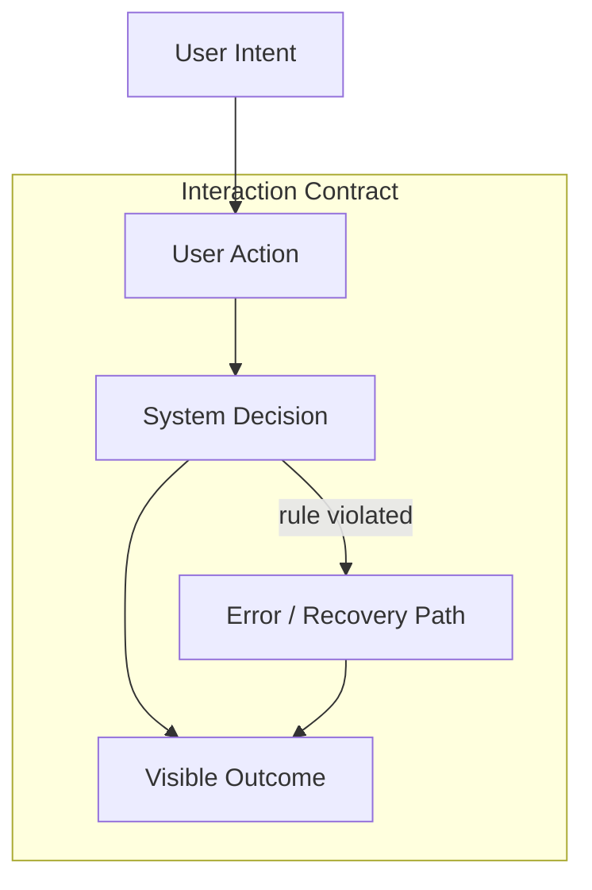
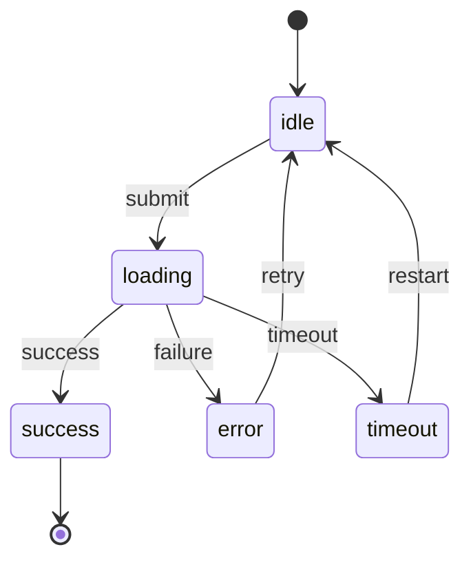
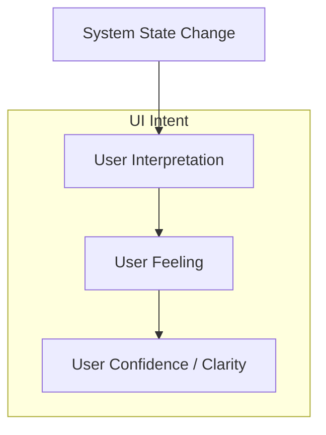
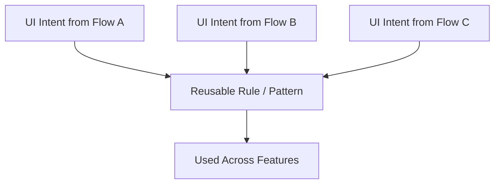

# Behavioral & Design System Diagrams

This document consolidates all conceptual diagrams for Layers **B, C, D, E** in the product-to-design-system pipeline.

---

## B — Layer 2: Interaction Contract
**Purpose:** Behavioral truth — what must happen.


**Interpretation:**  
“When the user does X, the system decides Y, and the user sees Z.”

---

## C — Layer 2.5: State Machine
**Purpose:** Behavioral enforcement — what is allowed or impossible.


**Interpretation:**  
“These are the only valid states. Anything else is a bug.”

---

## D — Layer 3: UI Intent
**Purpose:** Experience translation — how behavior is felt.


**Interpretation:**  
“When the system changes state, the UI ensures understanding, emotional safety, and orientation.”

---

## E — Design System Rules & Patterns
**Purpose:** Crystallized reuse — organization-level truths.


**Interpretation:**  
“When the same UI intent appears repeatedly, it becomes a system rule or pattern.”

---

## End-to-End Relationship (B → C → D → E)

```mermaid
flowchart LR
    B[Interaction Contract<br/>(What happens)]
    C[State Machine<br/>(What is allowed)]
    D[UI Intent<br/>(How it feels)]
    E[Design System<br/>(What we reuse)]

    B --> C
    C --> D
    D --> E
```
