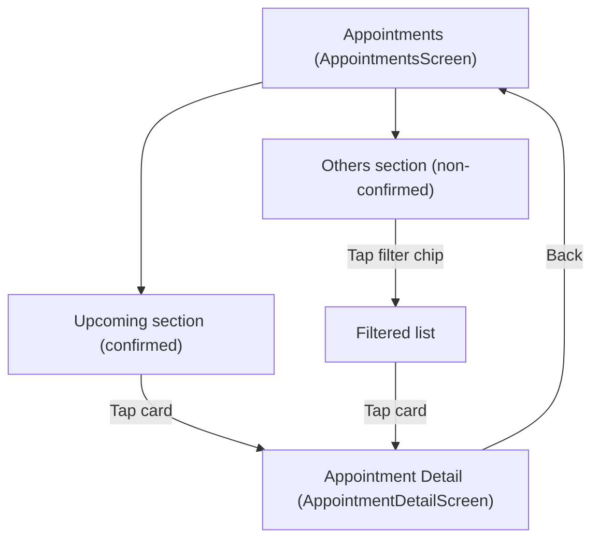

# Appointments — User Flow + Screen Spec

## Scope (as implemented in `apps/src`)
- Entry: `Tab: appointments` → `AppointmentsScreen`
- Deep links from this page:
  - `AppointmentDetailScreen` (tap any appointment card)

## User Flow

### Jobs-to-be-Done (JTBD)
- When I need to manage my care, I want to see upcoming confirmed appointments so I can prepare.
- When I have non-confirmed or changed appointments, I want to filter by status so I can triage what needs attention.
- When I open an appointment, I want clear next actions based on its current status so I know what to do now.

### Primary Flow (happy path)
1. Open Appointments tab.
2. Review upcoming confirmed appointment cards (swipe stack if multiple).
3. Review “Others” (all non-confirmed) grouped by date.
4. Tap an appointment card → open appointment detail.
5. Back returns to Appointments tab.

### Alternatives / edge cases (as implemented)
- Upcoming list can be empty → stack still renders header with count 0; no cards displayed.
- “Others” section filtering:
  - Filters apply only to non-confirmed appointments.
  - If a filter yields no items → shows “No appointments for the selected filter.”
- Appointment detail varies heavily by status (confirmed/matching/await_confirm/etc.).

### Flow Diagram (Appointments)


## Screen List (derived from flow)
| Screen | Type | Entry / Notes |
|---|---|---|
| `AppointmentsScreen` | Tab root | Bottom tab `appointments` |
| `AppointmentDetailScreen` | Detail | From `AppointmentsScreen` (tap any appointment card) |

## Screen Relationships
| From | To | Trigger | Notes / Back |
|---|---|---|---|
| `AppointmentsScreen` |  |  |  |
|  | `AppointmentDetailScreen` | Tap appointment card (Upcoming) | Opens selected appointment |
|  | `AppointmentDetailScreen` | Tap appointment card (Others) | Opens selected appointment |
| `AppointmentDetailScreen` |  |  |  |
|  | `AppointmentsScreen` | Back | Uses browser history (typically returns to Appointments tab) |

## Screen Details

#### Screen: AppointmentsScreen
**Purpose:** Provide a single place to view confirmed upcoming appointments and monitor all other appointment states with quick filtering.

**Layout structure:**
```text
+------------------------------------------------------+
| Header (sticky)                                      |
| [Title: Appointments]                                 |
| [Subtitle: appointment.subtitle]                      |
+------------------------------------------------------+
| Main                                                  |
| [Upcoming]                                             |
|   [CardStackWithPager: AppointmentListCard]            |
|                                                       |
| [Others]                                               |
|   [Filter chips] [All] [Awaiting] [Matching]           |
|                 [Modified] [Cancelled]                 |
|   [Group label (date)]                                 |
|   [AppointmentListCard] x N                             |
|   [Empty state card] (conditional)                     |
+------------------------------------------------------+
| BottomTabBar (fixed)                                  |
+------------------------------------------------------+
```

**State:**
| Area / Element | State | Condition / Trigger | Result / Notes |
|---|---|---|---|
| `Upcoming section` |  |  | Valid states: `empty`, `single`, `multiple`, `navigate`<br/>Allowed transitions: Data `empty` ↔ `single` ↔ `multiple`<br/>Tap card → `AppointmentDetailScreen(id)` |
|  | `empty` | No `confirmed` appointments | Header shows “Upcoming (0)”; no cards |
|  | `single` | Exactly 1 `confirmed` appointment | Single card; pager hidden |
|  | `multiple` | 2+ `confirmed` appointments | Swipe stack + pager dots shown |
|  | `navigate` | Tap upcoming card | Opens `AppointmentDetailScreen(id)` |
| `Others filter` |  |  | Valid states: `all`, `await_confirm`, `matching`, `modified_by_practice`, `cancelled_doctor`<br/>Allowed transitions: tap chip transitions between filter states |
|  | `all` | Default / tap All | Shows all non-confirmed appointments |
|  | `await_confirm` | Tap Awaiting chip | Filters to awaiting confirmation |
|  | `matching` | Tap Matching chip | Filters to matching |
|  | `modified_by_practice` | Tap Modified chip | Filters to modified |
|  | `cancelled_doctor` | Tap Cancelled chip | Filters to cancelled by doctor |
| `Others list` |  |  | Valid states: `empty`, `grouped`, `navigate`<br/>Allowed transitions: Data `empty` ↔ `grouped`<br/>Tap card → `AppointmentDetailScreen(id)` |
|  | `empty` | Filter yields 0 items | Shows “No appointments for the selected filter.” |
|  | `grouped` | Filter yields 1+ items | Grouped by `startsAt` date label |
|  | `navigate` | Tap appointment card (Others) | Opens `AppointmentDetailScreen(id)` |
| `AppointmentListCard rendering` |  |  | Valid states: `matching_placeholder`, `normal`<br/>Allowed transitions: data-driven by item status |
|  | `matching_placeholder` | `status = matching` | Skeleton placeholder UI (“?” + pulsing lines) |
|  | `normal` | Other statuses | Shows badge + date/time |

#### Screen: Appointment Detail (AppointmentDetailScreen)
**Purpose:** Show appointment detail content and a single bottom action tuned to status.

**Layout structure:**
```text
+------------------------------------------------------+
| DetailHeader (sticky)                                |
| [Back]                                                |
+------------------------------------------------------+
| [Status hero]                                         |
| [Status title]                                        |
| [Status description]                                  |
| [MatchingProgress] (matching only)                    |
| [AppointmentInfoCard] (most statuses)                 |
| [MatchingPlaceholderCard] (matching only)             |
| [UpdatedChanges] (modified_by_practice only)          |
| [Reason card] (cancelled_doctor only)                 |
| [Feedback card] (completed only)                      |
| [Top actions] (confirmed only)                        |
|  - [Button: Add to Calendar]                          |
|  - [Button: Export as .isc] [Button: Get Directions]  |
+------------------------------------------------------+
| PageBottomBar (fixed): bottomAction                   |
+------------------------------------------------------+
```

**State:**
| Area / Element | State | Condition / Trigger | Result / Notes |
|---|---|---|---|
| `Appointment data` |  |  | Valid states: `not_found`, `found`<br/>Allowed transitions: Change `appointmentId` toggles between states |
|  | `not_found` | `appointmentId` not in dataset | Screen returns `null` (set valid `appointmentId` → `found`) |
|  | `found` | `appointmentId` valid | Renders status-driven layout (set invalid `appointmentId` → `not_found`) |
| `Status variant` |  |  | Valid states: `matching`, `await_confirm`, `confirmed`, `modified_by_practice`, `completed`, `cancelled_patient`, `cancelled_doctor`<br/>Allowed transitions: data-driven between variants (see rows below) |
|  | `matching` | `status = matching` | MatchingProgress + placeholder; bottom action “Cancel Request”. Allowed transitions: match found → `await_confirm`/`confirmed`; practice declines → `cancelled_doctor`; cancel → `cancelled_patient` (not implemented) |
|  | `await_confirm` | `status = await_confirm` | Info card; bottom action “Cancel Request”. Allowed transitions: confirmed → `confirmed`; practice changes → `modified_by_practice`; practice declines → `cancelled_doctor`; cancel → `cancelled_patient` (not implemented) |
|  | `confirmed` | `status = confirmed` | Info card + top actions; bottom action “Cancel Appointment”. Allowed transitions: practice changes → `modified_by_practice`; visit completes → `completed`; practice cancels → `cancelled_doctor`; cancel → `cancelled_patient` (not implemented) |
|  | `modified_by_practice` | `status = modified_by_practice` | Info card + “What was updated”; bottom action “Cancel Appointment”. Allowed transitions: reconfirmed → `confirmed`; practice declines → `cancelled_doctor`; cancel → `cancelled_patient` (not implemented) |
|  | `completed` | `status = completed` | Info card + feedback card; bottom action “Book Follow-up Appointment” (booking flow not implemented) |
|  | `cancelled_patient` | `status = cancelled_patient` | Info card; bottom action “Book New Appointment” (booking flow not implemented) |
|  | `cancelled_doctor` | `status = cancelled_doctor` | Info card + reason card; bottom action “Book New Appointment” (booking flow not implemented) |
