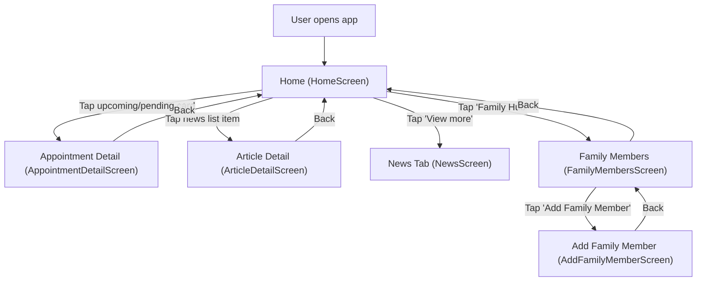

# Home — User Flow + Screen Spec

## Scope (as implemented in `apps/src`)
- Entry: `Tab: home` → `HomeScreen`
- Deep links from this page:
  - `AppointmentDetailScreen` (from upcoming + pending appointment cards)
  - `ArticleDetailScreen` (from latest news list)
  - `FamilyMembersScreen` → `AddFamilyMemberScreen` (from header “Family Hub”)

## User Flow

### Jobs-to-be-Done (JTBD)
- When I open the app, I want to quickly see my next appointment so I can plan my day.
- When I have pending/matching requests, I want to track progress so I know what to expect next.
- When I want to take action for my family, I want to manage family profiles so I can book on their behalf.
- When I’m between appointments, I want relevant health content so I can learn and prepare.

### Primary Flow (happy path)
1. Open app → land on Home.
2. Review “Upcoming Appointment” hero card.
3. Tap “Get Directions” (navigates to appointment detail in this prototype).
4. From Home, optionally open an article → read content → back returns to Home.
5. Optionally open Family Hub → add family member → back returns to Home.

### Alternatives / edge cases (as implemented)
- No confirmed appointment available → upcoming hero card is not shown.
- No pending appointments (`matching` / `await_confirm`) → pending card stack section is not shown.
- Latest news list always shows a slice of mock articles; “View more” navigates to the News tab.

### Flow Diagram (Home)


## Screen List (derived from flow)
| Screen | Type | Entry / Notes |
|---|---|---|
| `HomeScreen` | Tab root | Bottom tab `home` |
| `AppointmentDetailScreen` | Detail | From `HomeScreen` (upcoming hero CTA or pending card) |
| `ArticleDetailScreen` | Detail | From `HomeScreen` (latest news list item) |
| `FamilyMembersScreen` | Detail | From `HomeScreen` (header “Family Hub”) |
| `AddFamilyMemberScreen` | Detail | From `FamilyMembersScreen` (empty state CTA or header +) |

## Screen Relationships
| From | To | Trigger | Notes / Back |
|---|---|---|---|
| `HomeScreen` |  |  |  |
|  | `AppointmentDetailScreen` | Tap “Get Directions” on upcoming hero | Opens selected appointment |
|  | `AppointmentDetailScreen` | Tap pending appointment card | Opens selected appointment |
|  | `ArticleDetailScreen` | Tap article list item | Opens selected article |
|  | `NewsScreen` | Tap “View more” | Switches to News tab |
|  | `FamilyMembersScreen` | Tap header “Family Hub” | Opens family members |
| `FamilyMembersScreen` |  |  |  |
|  | `AddFamilyMemberScreen` | Tap “Add Family Member” | Opens add form |
|  | `AddFamilyMemberScreen` | Tap header (+) | Shortcut to add form |
|  | `HomeScreen` | Back | Uses browser history |
| `ArticleDetailScreen` |  |  |  |
|  | `HomeScreen` | Back | Returns to `sourceTab = home` |
| `AppointmentDetailScreen` |  |  |  |
|  | `HomeScreen` | Back | Uses browser history |
| `AddFamilyMemberScreen` |  |  |  |
|  | `FamilyMembersScreen` | Back | Uses browser history |

## Screen Details

#### Screen: HomeScreen
**Purpose:** Provide a “day-start” dashboard: next confirmed appointment, pending requests, quick booking entry points (visual only in this prototype), and latest health news.

**Layout structure:**
```text
+------------------------------------------------------+
| Header (sticky)                                      |
| [Avatar] [Greeting] [User name]           [Family Hub]|
+------------------------------------------------------+
| Main                                                  |
| [Upcoming Appointment Hero Card] (conditional)        |
|  [Status pill] [Icon]                                 |
|  [Doctor]                                              |
|  [Specialty]                                           |
|  [Date/time]                                           |
|  [Location]                                            |
|  [Button: Get Directions] [Icon button: Phone]         |
|                                                       |
| [Quick Book]                                           |
|  [Tile: Fast-lane] [Tile: Specialty] [Tile: Doctor]    |
|                                                       |
| [Pending] (conditional)                                |
|  [CardStackWithPager]                                  |
|   - [AppointmentListCard] x N                           |
|   - [Pager dots] (conditional)                          |
|                                                       |
| [Latest Health News]                                   |
|  [ArticleListItemCard] x 3                              |
|  [Button: View more]                                    |
+------------------------------------------------------+
| BottomTabBar (fixed): Home / News / Appointments /     |
|                     Notification / Profile             |
+------------------------------------------------------+
```

**State:**
| Area / Element | State | Condition / Trigger | Result / Notes |
|---|---|---|---|
| `Header` |  |  | Valid states: `default`, `navigate`<br/>Allowed transitions: Tap “Family Hub” → `FamilyMembersScreen` |
|  | `default` | `tab = home` | Shows avatar + greeting + “Family Hub” |
|  | `navigate` | Tap “Family Hub” | Opens `FamilyMembersScreen` |
| `Upcoming hero card` |  |  | Valid states: `hidden`, `shown`, `navigate`, `no-op`<br/>Allowed transitions: Data `hidden` ↔ `shown`<br/>Tap “Get Directions” → `AppointmentDetailScreen(aptId)` |
|  | `hidden` | No `confirmed` appointment exists | Not rendered |
|  | `shown` | Nearest `confirmed` appointment exists | Renders hero details + CTAs |
|  | `navigate` | Tap “Get Directions” | Opens `AppointmentDetailScreen(aptId)` |
|  | `no-op` | Tap phone icon button | Button renders; no handler |
| `Quick Book` |  |  | Valid states: `shown`<br/>Allowed transitions: none (visual-only tiles) |
|  | `shown` | Always | Visual-only tiles |
| `Pending section` |  |  | Valid states: `hidden`, `shown`<br/>Allowed transitions: Data `hidden` ↔ `shown` |
|  | `hidden` | No `matching` or `await_confirm` items | Not rendered |
|  | `shown` | Pending items exist | Shows `CardStackWithPager` |
| `Pending card rendering` |  |  | Valid states: `matching_placeholder`, `normal`<br/>Allowed transitions: Data-driven between states |
|  | `matching_placeholder` | `status = matching` | Skeleton placeholder UI (“?” + pulsing lines) |
|  | `normal` | `status = await_confirm` | Shows doctor/title/location + badge |
| `Pending pager` |  |  | Valid states: `hidden`, `shown`<br/>Allowed transitions: Data `hidden` ↔ `shown`<br/>Tap dot(index) keeps `shown` (activeIndex changes) |
|  | `hidden` | `items.length <= 1` | No dots |
|  | `shown` | `items.length > 1` | Dots visible; tap jumps to index |
| `Pending interaction` |  |  | Valid states: `idle`, `dragging`<br/>Allowed transitions: Drag start → `dragging`<br/>Drag end → `idle` (snap or rotate) |
|  | `idle` | Default | Not dragging |
|  | `dragging` | Pointer/touch drag active | Card translates/rotates; end drag snaps or rotates |
| `Latest Health News` |  |  | Valid states: `shown`, `navigate`, `switch_tab`<br/>Allowed transitions: Tap list item → `ArticleDetailScreen(articleId)`<br/>Tap “View more” → `NewsScreen` |
|  | `shown` | Always (mock slice) | 3 articles shown |
|  | `navigate` | Tap news list item | Opens `ArticleDetailScreen(articleId)` |
|  | `switch_tab` | Tap “View more” | Switches to `News` tab |

#### Screen: Appointment Detail (AppointmentDetailScreen)
**Purpose:** Show a single appointment’s status-driven messaging, details, and primary next action.

**Layout structure:**
```text
+------------------------------------------------------+
| DetailHeader (sticky)                                |
| [Back] [Title (optional)]                            |
| [Subtitle (optional)]                                |
+------------------------------------------------------+
| Main                                                  |
| [Status hero]                                         |
| [Status title]                                        |
| [Status description]                                  |
| [MatchingProgress] (matching only)                    |
| [AppointmentInfoCard] (most statuses)                 |
| [MatchingPlaceholderCard] (matching only)             |
| [UpdatedChanges] (modified_by_practice only)          |
| [Reason card] (cancelled_doctor only)                 |
| [Feedback card] (completed only)                      |
| [Top actions] (confirmed only)                        |
|  - [Button: Add to Calendar]                          |
|  - [Button: Export as .isc] [Button: Get Directions]  |
+------------------------------------------------------+
| PageBottomBar (fixed): Primary bottom action button   |
+------------------------------------------------------+
```

**State:**
| Area / Element | State | Condition / Trigger | Result / Notes |
|---|---|---|---|
| `Appointment data` |  |  | Valid states: `not_found`, `found`<br/>Allowed transitions: Change `appointmentId` toggles between states |
|  | `not_found` | `appointmentId` not in dataset | Screen returns `null` (set a valid `appointmentId` → `found`) |
|  | `found` | `appointmentId` valid | Renders status-driven layout (set invalid `appointmentId` → `not_found`) |
| `Status variant` |  |  | Valid states: `matching`, `await_confirm`, `confirmed`, `modified_by_practice`, `completed`, `cancelled_patient`, `cancelled_doctor`<br/>Allowed transitions: data-driven between variants (see rows below) |
|  | `matching` | `status = matching` | MatchingProgress + placeholder; bottom action “Cancel Request”. Allowed transitions: match found → `await_confirm`/`confirmed`; practice declines → `cancelled_doctor`; cancel → `cancelled_patient` (not implemented) |
|  | `await_confirm` | `status = await_confirm` | Info card; bottom action “Cancel Request”. Allowed transitions: confirmed → `confirmed`; practice changes → `modified_by_practice`; practice declines → `cancelled_doctor`; cancel → `cancelled_patient` (not implemented) |
|  | `confirmed` | `status = confirmed` | Info card + top actions; bottom action “Cancel Appointment”. Allowed transitions: practice changes → `modified_by_practice`; visit completes → `completed`; practice cancels → `cancelled_doctor`; cancel → `cancelled_patient` (not implemented) |
|  | `modified_by_practice` | `status = modified_by_practice` | Info card + “What was updated”; bottom action “Cancel Appointment”. Allowed transitions: reconfirmed → `confirmed`; practice declines → `cancelled_doctor`; cancel → `cancelled_patient` (not implemented) |
|  | `completed` | `status = completed` | Info card + feedback card; bottom action “Book Follow-up Appointment” (booking flow not implemented) |
|  | `cancelled_patient` | `status = cancelled_patient` | Info card; bottom action “Book New Appointment” (booking flow not implemented) |
|  | `cancelled_doctor` | `status = cancelled_doctor` | Info card + reason card; bottom action “Book New Appointment” (booking flow not implemented) |

#### Screen: Article Detail (ArticleDetailScreen)
**Purpose:** Let users read a selected article in a block-based detail layout (text/image/chart/video).

**Layout structure:**
```text
+------------------------------------------------------+
| DetailHeader (sticky): Back + title + published date  |
+------------------------------------------------------+
| Article blocks (Card-based)                           |
| [Text card] x N                                       |
| [Image card] x N                                      |
| [Chart card] x N                                      |
| [Video card] x N                                      |
+------------------------------------------------------+
```

**State:**
| Area / Element | State | Condition / Trigger | Result / Notes |
|---|---|---|---|
| `Article data` |  |  | Valid states: `not_found`, `found`<br/>Allowed transitions: Change `articleId` toggles between states |
|  | `not_found` | `articleId` not in dataset | Screen returns `null` (set valid `articleId` → `found`) |
|  | `found` | `articleId` valid | Renders `detailBlocks` in order (set invalid `articleId` → `not_found`) |
| `Blocks` |  |  | Valid states: `text`, `image`, `chart`, `video`<br/>Allowed transitions: render-only variants (no internal transitions) |
|  | `text` | `block.type = text` | Paragraph list rendered in a card |
|  | `image` | `block.type = image` | Image rendered; caption optional |
|  | `chart` | `block.type = chart` | Computes per-block max; renders scaled bars |
|  | `video` | `block.type = video` | Renders video card linking to external URL (new tab). Transition: click “Watch explainer” → external URL |

#### Screen: Family Members (FamilyMembersScreen)
**Purpose:** Enable users to manage family profiles used for booking on behalf of others (prototype currently shows only empty state).

**Layout structure:**
```text
+------------------------------------------------------+
| DetailHeader (sticky): Back + title/subtitle + (+)    |
+------------------------------------------------------+
| Empty state                                           |
| [Icon]                                                |
| [Title: No family members]                            |
| [Supporting copy]                                     |
| [Button: Add Family Member]                           |
+------------------------------------------------------+
```

**State:**
| Area / Element | State | Condition / Trigger | Result / Notes |
|---|---|---|---|
| `Screen data` |  |  | Valid states: `empty`, `list` (not implemented)<br/>Allowed transitions: Data-driven (`empty` → `list` when members exist; `list` → `empty` when removed) |
|  | `empty` | No family members (only implemented state) | Shows empty-state UI |
|  | `list` | Members exist (not implemented) | Would show member rows/cards |
| `Actions` |  |  | Valid states: `navigate`<br/>Allowed transitions: tap CTA/shortcut → `AddFamilyMemberScreen` |
|  | `navigate` | Tap “Add Family Member” | Opens `AddFamilyMemberScreen` |
|  | `navigate` | Tap header (+) | Opens `AddFamilyMemberScreen` |

#### Screen: Add Family Member (AddFamilyMemberScreen)
**Purpose:** Collect basic family member information required to book appointments on their behalf.

**Layout structure:**
```text
+------------------------------------------------------+
| DetailHeader (sticky): Back + title/subtitle          |
+------------------------------------------------------+
| Form                                                  |
| [Input: Full Name*]                                   |
| [Input: Date of Birth*] [Icon: calendar]              |
| [Relationship*]                                       |
|   [Option] [Option]                                   |
|   [Option] [Option]                                   |
| [Insurance Type (optional)]                           |
|   [Row: gkv]                                          |
|   [Row: pkv]                                          |
| [Input: eGK Card Number]                              |
+------------------------------------------------------+
| PageBottomBar (fixed): [Save Member]                  |
+------------------------------------------------------+
```

**State:**
| Area / Element | State | Condition / Trigger | Result / Notes |
|---|---|---|---|
| `Full Name input` |  |  | Valid states: `empty`, `filled`<br/>Allowed transitions: type → `filled`; clear → `empty` |
|  | `empty` | Initial or cleared | Placeholder shown |
|  | `filled` | User types | Value present |
| `Date of Birth input` |  |  | Valid states: `empty`, `filled`<br/>Allowed transitions: type → `filled`; clear → `empty` |
|  | `empty` | Initial or cleared | Placeholder `dd/mm/yyyy` shown (no date picker) |
|  | `filled` | User types | Value present |
| `Relationship` |  |  | Valid states: `unselected`, `selected`<br/>Allowed transitions: tap option → `selected` (value changes) |
|  | `unselected` | Initial | No option selected |
|  | `selected` | An option is selected | Selected style applied |
| `Insurance Type` |  |  | Valid states: `unselected`, `selected`<br/>Allowed transitions: tap option → `selected` (value changes) |
|  | `unselected` | Initial | No option selected |
|  | `selected` | An option is selected | Selected style applied |
| `eGK input` |  |  | Valid states: `empty`, `filled`<br/>Allowed transitions: type → `filled`; clear → `empty` |
|  | `empty` | Initial or cleared | Placeholder shown |
|  | `filled` | User types | Value present |
| `Form validity` |  |  | Valid states: `invalid`, `valid` (recommended; not implemented)<br/>Allowed transitions: fill required fields → `valid`; clear required field → `invalid` |
|  | `invalid` | Missing required fields | Should block save + show errors (not implemented) |
|  | `valid` | Required fields present | Save can proceed (recommended; not implemented) |
| `Save Member` |  |  | Valid states: `disabled`, `enabled`, `saving`, `saved` (not implemented)<br/>Allowed transitions: `valid` → enabled; tap → saving → saved |
|  | `disabled` | Recommended when form invalid | Not implemented (button always clickable) |
|  | `enabled` | Recommended when form valid | Button clickable |
|  | `saving` | Submit in progress (not implemented) | Would show progress UI |
|  | `saved` | Submit success (not implemented) | Would navigate back / show success |
