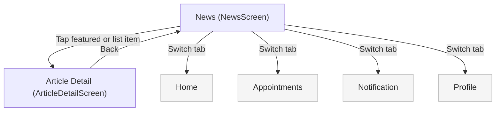

# News — User Flow + Screen Spec

## Scope (as implemented in `apps/src`)
- Entry: `Tab: news` → `NewsScreen`
- Deep links from this page:
  - `ArticleDetailScreen` (from featured story and list items)

## User Flow

### Jobs-to-be-Done (JTBD)
- When I want to learn about health topics, I want a curated feed so I can discover relevant content quickly.
- When I find an interesting article, I want to open the full story so I can understand details and take action later.
- When I return from an article, I want to resume where I was so I don’t lose my place in exploration.

### Primary Flow (happy path)
1. Open News tab.
2. Tap featured story or a list item.
3. Read article blocks (text/image/chart/video).
4. Back returns to News tab.

### Alternatives / edge cases (as implemented)
- If there are no articles → featured card will not render; list would be empty (mock data currently provides articles).
- “Load more” uses `IntersectionObserver`:
  - If unsupported (older browsers / test env) → infinite-load won’t trigger automatically.
  - When all articles visible → “Loading more articles…” indicator is hidden.

### Flow Diagram (News)


## Screen List (derived from flow)
| Screen | Type | Entry / Notes |
|---|---|---|
| `NewsScreen` | Tab root | Bottom tab `news` |
| `ArticleDetailScreen` | Detail | From `NewsScreen` (featured or list item) |

## Screen Relationships
| From | To | Trigger | Notes / Back |
|---|---|---|---|
| `NewsScreen` |  |  |  |
|  | `ArticleDetailScreen` | Tap featured story | Opens article detail |
|  | `ArticleDetailScreen` | Tap an article list item | Opens article detail |
| `ArticleDetailScreen` |  |  |  |
|  | `NewsScreen` | Back | Returns to `sourceTab = news` |

## Screen Details

#### Screen: NewsScreen
**Purpose:** Provide a “content discovery” feed with a featured story and an infinite-loading list.

**Layout structure:**
```text
+------------------------------------------------------+
| Header (sticky)                                      |
| [Title: News]                                         |
| [Subtitle: news.subtitle]                             |
+------------------------------------------------------+
| Main                                                  |
| [Featured Story Card] (conditional)                   |
|  +--------------------------------------------------+ |
|  | [Cover image] [New pill]                         | |
|  | [Title]                                          | |
|  | [Summary]                                        | |
|  | [CTA hint: Read Full Story]                      | |
|  +--------------------------------------------------+ |
|                                                       |
| Latest Health News                                     |
| [ArticleListItemCard] x N                              |
| [Infinite-load sentinel] (conditional)                 |
+------------------------------------------------------+
| BottomTabBar (fixed)                                  |
+------------------------------------------------------+
```

**State:**
| Area / Element | State | Condition / Trigger | Result / Notes |
|---|---|---|---|
| `Featured story` |  |  |  |
|  | `hidden` | No articles available | Featured card not rendered |
|  | `shown` | Articles available | Uses most recent article as featured |
|  | `navigate` | Tap featured card | Opens `ArticleDetailScreen(featuredId)` |
| `Latest list` |  |  |  |
|  | `initial` | Screen load | Shows up to 5 articles (excluding featured) |
|  | `auto_load_more` | Sentinel intersects & `IntersectionObserver` available | Increases visible count by +3 (up to total) |
|  | `done` | `newsVisibleCount >= newsArticles.length` | Sentinel hidden |
|  | `no_observer` | `IntersectionObserver` unavailable | List stays at initial count |
|  | `navigate` | Tap article list item | Opens `ArticleDetailScreen(articleId)` |

#### Screen: Article Detail (ArticleDetailScreen)
**Purpose:** Present an article in a readable, card-based block layout.

**Layout structure:**
```text
+------------------------------------------------------+
| DetailHeader (sticky): Back + title + published date  |
+------------------------------------------------------+
| Article blocks (Card-based)                           |
| - Text / Image / Chart / Video blocks                 |
+------------------------------------------------------+
```

**State:**
| Area / Element | State | Condition / Trigger | Result / Notes |
|---|---|---|---|
| `Article data` |  |  |  |
|  | `not_found` | `articleId` not in dataset | Screen returns `null` |
|  | `found` | `articleId` valid | Renders `detailBlocks` in order |
| `Blocks` |  |  |  |
|  | `text_render` | `block.type = text` | Paragraph list rendered in a card |
|  | `image_render` | `block.type = image` | Image rendered; caption optional |
|  | `chart_render` | `block.type = chart` | Computes per-block max; renders scaled bars |
|  | `video_render_link` | `block.type = video` | Renders video card linking to external URL (new tab) |
