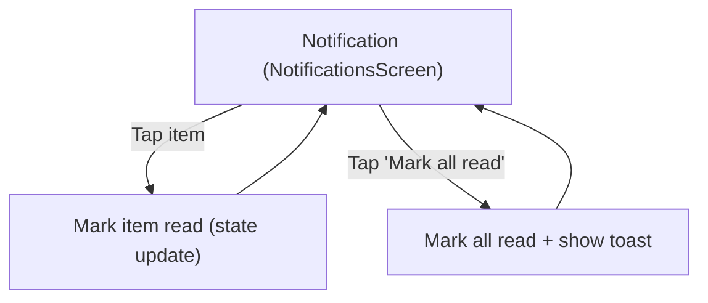

# Notification — User Flow + Screen Spec

## Scope (as implemented in `apps/src`)
- Entry: `Tab: notifications` → `NotificationsScreen`
- Page-level behaviors owned by `App.tsx` while on this tab:
  - Header “Mark all read” action (enabled only when unread count > 0).
  - Toast message after “Mark all read”.

## User Flow

### Jobs-to-be-Done (JTBD)
- When something changes about my care (booking updates, reminders), I want a clear notification feed so I can stay informed.
- When I’m triaging information, I want to quickly mark items as read so I can focus on what’s new.
- When I open the notifications page, I want items grouped by recency so I can prioritize.

### Primary Flow (happy path)
1. Open Notification tab.
2. Scan groups (Today / Yesterday / Earlier).
3. Tap a notification item to mark it as read.
4. Optionally tap “Mark all read” to clear unread state.

### Alternatives / edge cases (as implemented)
- If a group has no items → that group section is not shown.
- If there are no unread notifications → “Mark all read” does nothing and is visually de-emphasized.
- Clicking a notification currently marks read but does not navigate (no detail screen).

### Flow Diagram (Notification)


## Screen List (derived from flow)
| Screen | Type | Entry / Notes |
|---|---|---|
| `NotificationsScreen` | Tab root | Bottom tab `notifications` |

## Screen Relationships
| From | To | Trigger | Notes / Back |
|---|---|---|---|
| `NotificationsScreen` |  |  |  |
|  | — | Tap notification card | Marks as read only (no navigation) |

## Screen Details

#### Screen: NotificationsScreen
**Purpose:** Display notifications grouped by recency and allow users to mark items read.

**Layout structure:**
```text
+------------------------------------------------------+
| Header (sticky)                                      |
| [Title: Notification]                                 |
| [Subtitle: notification.subtitle]                     |
| [Action: Mark all read]                               |
+------------------------------------------------------+
| Main                                                  |
| [Group: Today] (conditional)                          |
|   [NotificationCard] x N                              |
| [Group: Yesterday] (conditional)                      |
|   [NotificationCard] x N                              |
| [Group: Earlier] (conditional)                        |
|   [NotificationCard] x N                              |
+------------------------------------------------------+
| Toast (fixed above tab bar, conditional)               |
| [Toast message]                                       |
+------------------------------------------------------+
| BottomTabBar (fixed)                                  |
+------------------------------------------------------+
```

**State:**
| Area / Element | State | Condition / Trigger | Result / Notes |
|---|---|---|---|
| `Group sections` |  |  |  |
|  | `hidden` | Group array length = 0 | Section not rendered |
|  | `shown` | Group array length > 0 | Renders group label + list |
| `Notification card` |  |  |  |
|  | `unread` | `item.unread = true` | Shows unread styling + `unreadAriaLabel` |
|  | `read` | `item.unread = false` | Normal styling |
|  | `booking_update` | `item.type = booking_update` | Calendar icon, cyan tone |
|  | `upcoming` | `item.type = upcoming` | Bell icon, amber tone |
|  | `content` | `item.type = content` | Settings icon, violet tone |
|  | `mark_read` | Tap notification card | Calls `onMarkRead(id)` → sets `unread=false` |
| `Header action: Mark all read` |  |  |  |
|  | `no-op` | `unreadNotificationCount = 0` | Handler returns early |
|  | `active` | `unreadNotificationCount > 0` | Marks all read, shows toast |
|  | `highlighted` | Unread count > 0 | Teal label style |
|  | `muted` | `keepReadActionHighlighted=true` after action | Muted label style when all read |
| `Toast` |  |  |  |
|  | `hidden` | `toastMessage = null` | No toast shown |
|  | `shown` | Mark-all read completes | Shows `notification.allReadToast` for ~2.2s |
