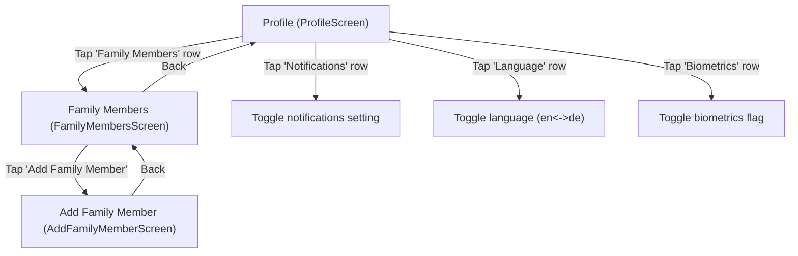

# Profile — User Flow + Screen Spec

## Scope (as implemented in `apps/src`)
- Entry: `Tab: profile` → `ProfileScreen`
  - Note: `App.tsx` does not render the standard header while on `profile` tab (header is `null`).
- Deep links from this page:
  - `FamilyMembersScreen` → `AddFamilyMemberScreen` (from “Family Members” row)

## User Flow

### Jobs-to-be-Done (JTBD)
- When I need to manage my account, I want a single settings hub so I can update preferences without hunting through the app.
- When I book for family, I want to manage family members so I can choose the right patient during booking.
- When I need help, I want easy access to support so I can resolve issues quickly.

### Primary Flow (happy path)
1. Open Profile tab.
2. Review profile summary (avatar + email).
3. Toggle app settings (notifications / language).
4. Open Family Members → add a family member.
5. Return to Profile.

### Alternatives / edge cases (as implemented)
- Settings rows are buttons; most do not navigate in the current prototype.
- “Log out” button is present but has no handler (no-op).

### Flow Diagram (Profile)


## Screen List (derived from flow)
| Screen | Type | Entry / Notes |
|---|---|---|
| `ProfileScreen` | Tab root | Bottom tab `profile` (no standard header rendered) |
| `FamilyMembersScreen` | Detail | From `ProfileScreen` (“Family Members” row) |
| `AddFamilyMemberScreen` | Detail | From `FamilyMembersScreen` (empty state CTA or header +) |

## Screen Relationships
| From | To | Trigger | Notes / Back |
|---|---|---|---|
| `ProfileScreen` |  |  |  |
|  | `FamilyMembersScreen` | Tap “Family Members” row | Navigates to family members |
| `FamilyMembersScreen` |  |  |  |
|  | `AddFamilyMemberScreen` | Tap “Add Family Member” | Opens add form |
|  | `AddFamilyMemberScreen` | Tap header (+) | Shortcut to add form |
|  | `ProfileScreen` | Back | Uses browser history |
| `AddFamilyMemberScreen` |  |  |  |
|  | `FamilyMembersScreen` | Back | Uses browser history |

## Screen Details

#### Screen: ProfileScreen
**Purpose:** Central hub for account/profile settings and shortcuts (family, language, notifications, support).

**Layout structure:**
```text
+------------------------------------------------------+
| [No standard header on this tab]                      |
+------------------------------------------------------+
| Main                                                  |
| [Profile summary]                                     |
|  - [Avatar (lg)]                                      |
|  - [Name]                                             |
|  - [Email]                                            |
|                                                       |
| [SettingsSection: PROFILE INFORMATION]                |
|  - [Row: Personal Information]                        |
|  - [Row: Address]                                     |
|  - [Row: Insurance]                                   |
|  - [Row: Family Members] (navigates)                  |
|                                                       |
| [SettingsSection: SECURITY SETTINGS]                  |
|  - [Row: Change Password]                             |
|  - [Row: Biometrics] [Trailing: ON/OFF]               |
|  - [Row: Privacy & Data]                              |
|                                                       |
| [SettingsSection: APP SETTINGS]                       |
|  - [Row: Notifications] [Trailing: ON/OFF]            |
|  - [Row: Language] [Trailing: English/Deutsch]        |
|                                                       |
| [SettingsSection: SUPPORT]                            |
|  - [Row: FAQ]                                         |
|  - [Row: Contact Support]                             |
|  - [Row: Help Center]                                 |
|                                                       |
| [Log out] button                                      |
| [Version label]                                       |
+------------------------------------------------------+
| BottomTabBar (fixed)                                  |
+------------------------------------------------------+
```

**State:**
| Area / Element | State | Condition / Trigger | Result / Notes |
|---|---|---|---|
| `Profile summary` |  |  |  |
|  | `static` | Always | Placeholder name “User” and email “name@example.com” |
| `Settings rows` |  |  |  |
|  | `default` | Rendered | Icon + title (+ subtitle when provided) + chevron |
|  | `pressed/focus` | Pointer/keyboard interaction | Browser-driven button states |
|  | `navigate` | Tap row `id=family` | Opens `FamilyMembersScreen` |
|  | `toggle_biometrics` | Tap row `id=biometrics` | Toggles `feedbackReminder` → trailing ON/OFF |
|  | `toggle_notifications` | Tap row `id=notifications` | Toggles `appointmentNotification` → trailing ON/OFF |
|  | `toggle_language` | Tap row `id=language` | Toggles language store `en` ↔ `de` → trailing label changes |
|  | `no-op` | Tap any other row | No navigation/side-effect in current prototype |
| `Log out` |  |  |  |
|  | `no-op` | Tap “Log out” | Button renders; no handler |

#### Screen: Family Members (FamilyMembersScreen)
**Purpose:** Manage family members; currently only an empty state with an add action.

**Layout structure:**
```text
+------------------------------------------------------+
| DetailHeader: Back + title/subtitle + (+)             |
+------------------------------------------------------+
| Empty state                                           |
| [Icon]                                                |
| [Title: No family members]                            |
| [Supporting copy]                                     |
| [Button: Add Family Member]                           |
+------------------------------------------------------+
```

**State:**
| Area / Element | State | Condition / Trigger | Result / Notes |
|---|---|---|---|
| `Screen data` |  |  |  |
|  | `empty` | Only implemented state | Shows empty-state UI |
| `Actions` |  |  |  |
|  | `navigate` | Tap “Add Family Member” | Opens `AddFamilyMemberScreen` |
|  | `navigate` | Tap header (+) | Opens `AddFamilyMemberScreen` |

#### Screen: Add Family Member (AddFamilyMemberScreen)
**Purpose:** Collect required fields for creating a family profile used in booking.

**Layout structure:**
```text
+------------------------------------------------------+
| DetailHeader: Back + title/subtitle                   |
+------------------------------------------------------+
| Form fields + selection controls                      |
+------------------------------------------------------+
| PageBottomBar: [Save Member]                          |
+------------------------------------------------------+
```

**State:**
| Area / Element | State | Condition / Trigger | Result / Notes |
|---|---|---|---|
| `Full Name input` |  |  |  |
|  | `empty` | Initial | Placeholder shown |
|  | `filled` | User types | Value present |
| `Date of Birth input` |  |  |  |
|  | `empty` | Initial | Placeholder `dd/mm/yyyy` shown |
|  | `filled` | User types | Value present (no date picker) |
| `Relationship` |  |  |  |
|  | `unselected` | Initial | No option selected |
|  | `selected` | Tap option | Selected style applied (`child/spouse/parent/other`) |
| `Insurance Type` |  |  |  |
|  | `unselected` | Initial | No option selected |
|  | `selected` | Tap option | Selected style applied (`gkv/pkv`) |
| `eGK input` |  |  |  |
|  | `empty` | Initial | Placeholder shown |
|  | `filled` | User types | Value present |
| `Save Member` |  |  |  |
|  | `no-op` | Tap bottom button | Button renders; no submit handler |
| `Validation` |  |  |  |
|  | `recommended` | Missing required fields | Should block save + show errors (not implemented) |
