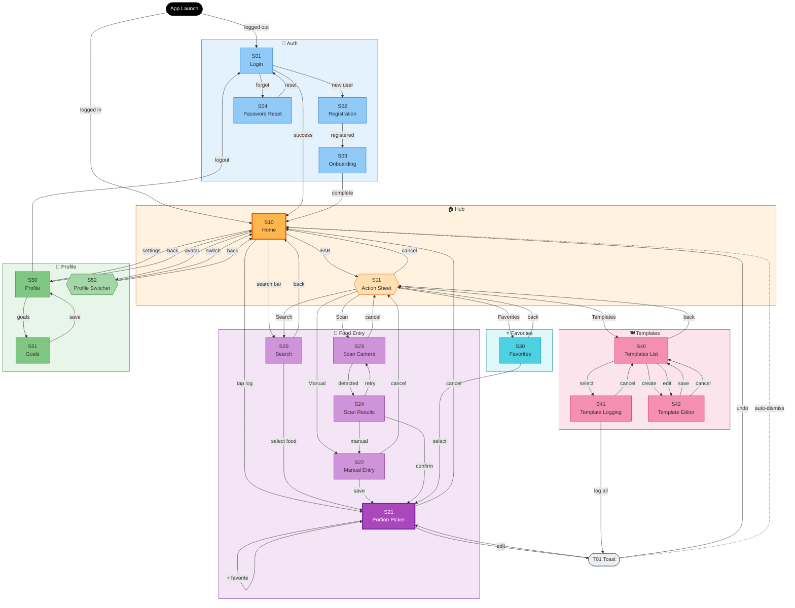

# Screen List - Calo Tracker

**Last Updated:** Jan 6, 2026
**Derived from:** [User Flows](../userflows/user-flows-complete.md)
**Source:** [OOUX Dot Map](./OOUX-dot-map.md)

---

## Derivation Methodology

```
OOUX DOT MAP                    USER FLOWS                      SCREEN LIST
─────────────────────          ─────────────────────           ─────────────────────
7 Objects                  →   10 Jobs-to-be-done         →   17 Screens + 1 Toast
~30 Actions                    ~50 Flow moments
                               Decision points = screens
                               Input moments = screens
                               View moments = screens
                               Feedback = overlays
```

---

## Screen Identification from Flow Moments

| Flow Moment | Type | Screen Needed? | Rationale |
|-------------|------|----------------|-----------|
| Entry point | Decision | Yes → **Entry Hub** | User chooses HOW to log |
| Search input + results | Input + View | Yes → **Search** | Active input + scrollable results |
| Category browse | View | Merge with Search | Same results pattern, filter |
| Portion selection | Input | Yes → **Portion Picker** | Focused decision, shared across flows |
| Feedback confirmation | Feedback | No → **Toast** | Non-blocking, undo support |
| Favorites grid | View | Yes → **Favorites** | Visual recognition pattern |
| Manual entry form | Input | Yes → **Manual Entry** | Multiple fields, form validation |
| Camera viewfinder | Capture | Yes → **Scan Camera** | Full-screen camera |
| Scan confirmation | Decision | Yes → **Scan Results** | Confirm/reject match |
| Template list | View | Yes → **Templates** | List with preview |
| Template items edit | Input | Yes → **Template Logging** | Checkbox per item |
| Template editor | Input | Yes → **Template Editor** | Create/edit form |
| Dashboard summary | View | Yes → **Home** | Primary landing |
| Log history | View | Merge with Home | Part of daily view |
| Goal settings | Input | Yes → **Goal Settings** | Form with sliders |
| Profile settings | View | Yes → **Profile** | Settings hub |
| Login form | Input | Yes → **Login** | Auth form |
| Registration form | Input | Yes → **Registration** | Auth form |
| Onboarding goals | Input | Yes → **Onboarding** | First-time flow |
| Favorites management | Input | Modal or merge | Edit mode on Favorites |

---

## Consolidated Screen List

| ID | Screen | Derived from Flow(s) | Primary Purpose |
|----|--------|---------------------|-----------------|
| **AUTH** |
| S01 | **Login** | J10 | Credential input |
| S02 | **Registration** | J10 | Account creation |
| S03 | **Onboarding** | J10 | Initial goal setup |
| S04 | **Password Reset** | J10 | Recovery flow |
| **HUB** |
| S10 | **Home** | J6, all flows end here | Dashboard + log history |
| S11 | **Action Sheet** | J1-J5 entry points | Entry method selection (modal) |
| **FOOD ENTRY** |
| S20 | **Search** | J1 | Query input + results + category filter |
| S21 | **Portion Picker** | J1, J2, J3, J4 | Portion selection (shared) |
| S22 | **Manual Entry** | J3 | Custom food form |
| S23 | **Scan Camera** | J4 | Camera viewfinder |
| S24 | **Scan Results** | J4 | Match confirmation |
| **FAVORITES** |
| S30 | **Favorites** | J2, J7 | Grid view + manage mode |
| **TEMPLATES** |
| S40 | **Templates List** | J5, J8 | List + preview |
| S41 | **Template Logging** | J5 | Item selection before log |
| S42 | **Template Editor** | J8 | Create/edit template |
| **PROFILE** |
| S50 | **Profile Settings** | J9 | Settings hub |
| S51 | **Goal Settings** | J9 | Calorie + macro targets |
| S52 | **Profile Switcher** | Multi-user | Context switch (modal) |
| **FEEDBACK** |
| T01 | **Toast** | All logging flows | Confirmation + undo (overlay) |

---

## Screen-to-Job Mapping

| Screen | Jobs Supported |
|--------|----------------|
| S01 Login | J10 |
| S02 Registration | J10 |
| S03 Onboarding | J10 |
| S04 Password Reset | J10 |
| S10 Home | J1, J2, J3, J4, J5, J6 |
| S11 Action Sheet | J1, J2, J3, J4, J5 |
| S20 Search | J1 |
| S21 Portion Picker | J1, J2, J3, J4 |
| S22 Manual Entry | J3 |
| S23 Scan Camera | J4 |
| S24 Scan Results | J4 |
| S30 Favorites | J2, J7 |
| S40 Templates List | J5, J8 |
| S41 Template Logging | J5 |
| S42 Template Editor | J8 |
| S50 Profile Settings | J9 |
| S51 Goal Settings | J9 |
| S52 Profile Switcher | Multi-user |
| T01 Toast | J1, J2, J3, J4, J5 |

---

## User Flow with Screens



---

## Screen Frequency (Expected Usage)

| Frequency | Screens |
|-----------|---------|
| **Every session** | S10 (Home), S11 (Action Sheet), S21 (Portion Picker), T01 (Toast) |
| **Most sessions** | S20 (Search), S30 (Favorites Grid) |
| **Weekly** | S40 (Templates), S22 (Manual Entry) |
| **Monthly** | S50 (Profile), S51 (Goals) |
| **Once** | S01 (Login), S02 (Registration), S03 (Onboarding) |

---

## Primary Paths (Happy Paths)

| Flow | Path | Object Journey |
|------|------|----------------|
| **Quick Log (Search)** | Home → Action Sheet → Search → Portion Picker → Home + Toast | User → System Food → Food Log |
| **Quick Log (Favorites)** | Home → Action Sheet → Favorites → Portion Picker → Home + Toast | User → Favorite → Food Log |
| **Manual Entry** | Home → Action Sheet → Manual Entry → Portion Picker → Home + Toast | User → Custom Food → Food Log |
| **Scan Entry** | Home → Action Sheet → Scan → Results → Portion Picker → Home + Toast | User → System Food → Food Log |
| **Template Log** | Home → Action Sheet → Templates → Template Logging → Home + Toast | User → Meal Template → Food Log (multiple) |

---

## Key UX Patterns

| Pattern | Implementation | Supports <30s Goal |
|---------|----------------|-------------------|
| **Hub & Spoke** | All entry methods return to Home | Single mental model |
| **Progressive Disclosure** | Action Sheet → specific method | Reduces cognitive load |
| **Recognition > Recall** | Favorites Grid, Recent searches | Fewer taps |
| **Undo over Confirmation** | Toast with undo vs. confirm dialogs | Faster happy path |
| **Shared Portion Picker** | All paths funnel to S21 | Consistent interaction |

---

## Summary

| Metric | Count |
|--------|-------|
| Objects (OOUX) | 7 |
| Jobs (User Flows) | 10 |
| Screens | 17 |
| Modals/Overlays | 3 (Action Sheet, Profile Switcher, Toast) |
| Shared screens | 1 (Portion Picker serves 4 flows) |

---

**Related Documents:**
- [OOUX Dot Map](./OOUX-dot-map.md)
- [User Flows](../userflows/user-flows-complete.md)
- [IA Map](../ia-map/IA.md)
