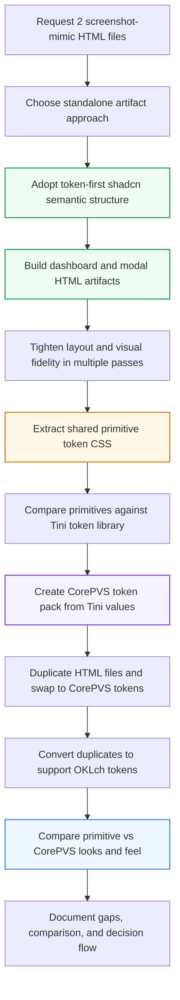

# Visual Stress-Test Flow

## Diagram 1: Short Flow

```mermaid
flowchart TD
    A[Request 2 screenshot-mimic HTML files] --> B[Choose standalone artifact approach]
    B --> C[Adopt token-first shadcn semantic structure]
    C --> D[Build dashboard and modal HTML artifacts]
    D --> E[Tighten layout and visual fidelity in multiple passes]
    E --> F[Extract shared primitive token CSS]
    F --> G[Compare primitives against Tini token library]
    G --> H[Create CorePVS token pack from Tini values]
    H --> I[Duplicate HTML files and swap to CorePVS tokens]
    I --> J[Convert duplicates to support OKLch tokens]
    J --> K[Compare primitive vs CorePVS looks and feel]
    K --> L[Document gaps, comparison, and decision flow]

    style C fill:#eefcf3,stroke:#16a34a,stroke-width:1.5px
    style D fill:#eefcf3,stroke:#16a34a,stroke-width:1.5px
    style F fill:#fff8e8,stroke:#d97706,stroke-width:1.5px
    style H fill:#f5f3ff,stroke:#7c3aed,stroke-width:1.5px
    style K fill:#eef6ff,stroke:#3b82f6,stroke-width:1.5px
```

## Diagram 2: Full Flow

```mermaid
flowchart TD
    A[User requests 2 HTML files to mimic screenshots with shadcn and design system] --> B[Review repo context, naming rules, existing frontend stack, brainstorming gate]
    B --> C{Implementation target?}
    C -->|Standalone HTML artifacts| D[Choose artifacts folder approach]
    C -->|App pages| X[Rejected for this thread]

    D --> E{Interaction scope?}
    E -->|Light interactions| F[Plan standalone token-first HTML artifacts]
    E -->|Static only| Y[Alternative not chosen]

    F --> G{White-label direction?}
    G -->|Strict shadcn semantic token model| H[Adopt token-first structure with semantic shadcn layer]
    G -->|Screenshot-first styling| Z[Rejected because weak for white-label]

    H --> I[Implement 2 artifact HTML files]
    I --> I1[DATA260312-synthcare-dashboard.html]
    I --> I2[DATA260312-purchase-order-modal.html]

    I --> J{Tighten visual fidelity?}
    J -->|Yes| K[Pass 1: structure-first proportion tuning]
    K --> L[Pass 2: element-level fidelity tuning]
    L --> M[Pass 3: remaining illustration and micro-spacing gaps]
    M --> N[Final screenshot-like artifact pair established]

    N --> O{How to test white-label token swap?}
    O -->|Extract primitives| P[Refactor shared primitive tokens into external CSS]
    P --> P1[Create DATA260312-brand-primitives.css]
    P --> P2[Update original HTML files to link shared primitive token file]

    P2 --> Q{Compare primitives CSS against Tini Tokens Library?}
    Q -->|Yes| R[Gap analysis against token library spec]
    R --> R1[Create RSYN260312-tini-token-gap.md]

    R1 --> S{Need CorePVS brand pack?}
    S -->|Yes| T[Duplicate primitive CSS as CorePVS token pack]
    T --> T1[Create DATA260312-corepvs-brand-primitives.css]
    T1 --> T2[Swap values from Tini Tokens Library]
    T2 --> T3[Mark swapped values with asterisk marker]

    T3 --> U{How should CorePVS duplicates consume tokens?}
    U -->|Switch to OKLch values| V[Duplicate HTML files and make color usage format-agnostic]
    V --> V1[Create DATA260312-corepvs-dashboard.html]
    V --> V2[Create DATA260312-corepvs-purchase-order.html]
    V --> V3[Swap token links to CorePVS pack]
    V --> V4[Convert duplicates away from HSL-only token consumption]

    V4 --> W{Evaluate looks and feel?}
    W -->|Yes| AA[Render primitive and CorePVS pairs]
    AA --> AB[Compare aesthetic, hierarchy, white-label readiness, screenshot fidelity]
    AB --> AC[Create RSYN260312-primitive-vs-corepvs-comparison.md]

    AC --> AD{Document decision flow?}
    AD -->|Yes| AE[Create this Mermaid flow artifact]

    style D fill:#eef6ff,stroke:#3b82f6,stroke-width:1.5px
    style H fill:#eefcf3,stroke:#16a34a,stroke-width:1.5px
    style I fill:#eefcf3,stroke:#16a34a,stroke-width:1.5px
    style P fill:#fff8e8,stroke:#d97706,stroke-width:1.5px
    style R fill:#fff8e8,stroke:#d97706,stroke-width:1.5px
    style T fill:#f5f3ff,stroke:#7c3aed,stroke-width:1.5px
    style V fill:#f5f3ff,stroke:#7c3aed,stroke-width:1.5px
    style AB fill:#eef6ff,stroke:#3b82f6,stroke-width:1.5px
    style AE fill:#eefcf3,stroke:#16a34a,stroke-width:1.5px
```
