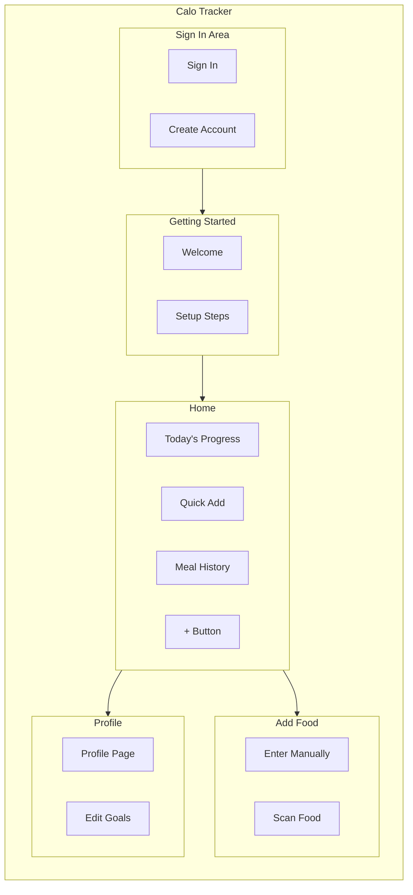
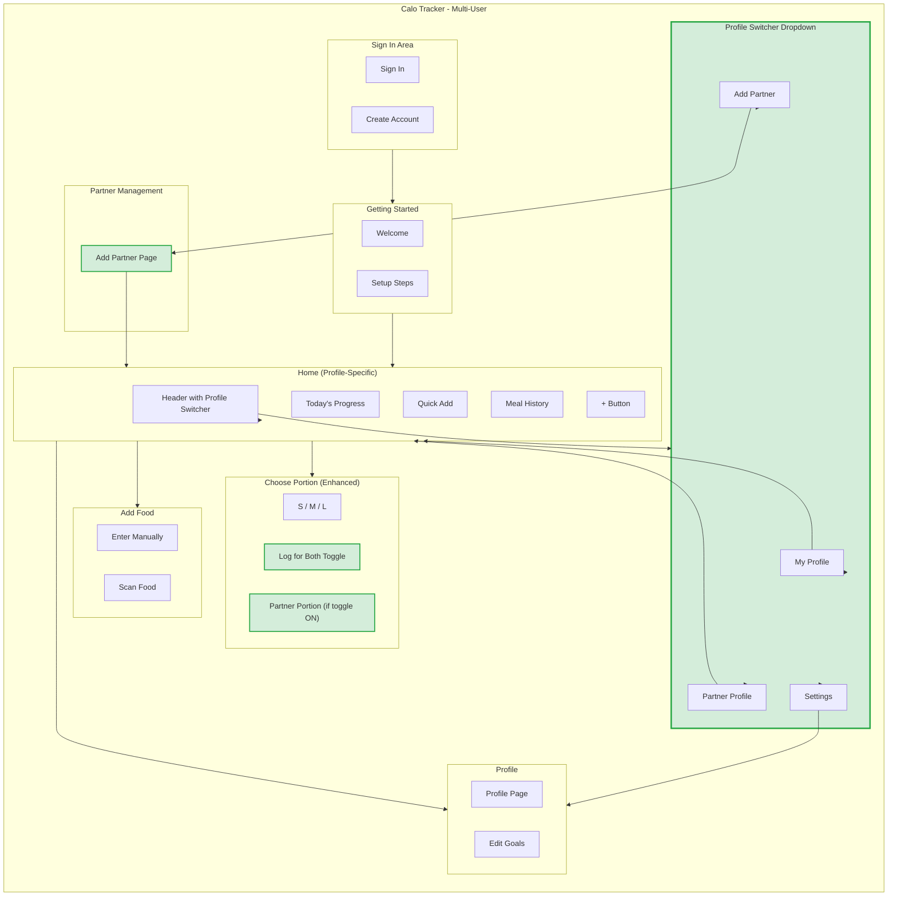

# IA Map - CR05 Multi-User Support

## Where CR05 Objects Live

| Object | Main Location | Also Appears In | How to Access |
|--------|---------------|-----------------|---------------|
| **Profile** | Profile page | Home header (avatar) | Tap avatar → Profile Switcher |
| **Partner Link** | Add Partner page | Profile Switcher dropdown | Tap avatar → "Add Partner" |
| **Consent** | Add Partner page | (Settings - future) | During partner setup |
| **Food Log** | Home (Meal History) | - | Scroll to Meal History |
| **Shared Meal** | Home (Meal History) | - | Auto-linked, visual indicator |

---

## Current App Structure (Before CR05)



---

## Updated App Structure (With CR05)



---

## IA Changes Summary

### New Elements

| Element | Location | Purpose |
|---------|----------|---------|
| **Profile Switcher** | Home header (dropdown) | Switch between self and partner views |
| **Add Partner** | New page `/add-partner` | Create partner profile |
| **"Log for Both" Toggle** | Choose Portion pop-up | Enable dual logging |
| **Partner Portion Selector** | Choose Portion pop-up | Pick different size for partner |

### Modified Elements

| Element | Change | Impact |
|---------|--------|--------|
| **Home** | Now profile-specific | Shows active profile's data |
| **Today's Progress** | Profile-specific | Ring/macros for active profile |
| **My Favorites** | Profile-specific | Separate favorites per profile |
| **Meal History** | Profile-specific | Shows active profile's logs |
| **Choose Portion** | Enhanced | Added toggle + partner portion |
| **Notification** | Enhanced | Shows "Added for you + [Partner]" |

### Unchanged Elements

| Element | Reason |
|---------|--------|
| Sign In / Create Account | No change to auth flow |
| Getting Started | Same onboarding for primary user |
| Enter Manually | Works same, respects active profile |
| Scan Food | Works same, respects active profile |
| Edit Goals | Works same, per-profile goals |

---

## Navigation Paths

### New Navigation Paths (CR05)

| From | To | How | Purpose |
|------|-----|-----|---------|
| Home | Profile Switcher | Tap avatar in header | Access profile options |
| Profile Switcher | Partner View | Tap partner avatar | Switch to partner's dashboard |
| Profile Switcher | Add Partner | Tap "Add Partner" | Create partner profile |
| Add Partner | Home | Complete setup | Return after adding partner |
| Choose Portion | Dual Log | Toggle "Log for Both" | Log for both profiles |

### Updated Navigation

| Navigation | Before | After |
|------------|--------|-------|
| Tap avatar | → Profile page | → Profile Switcher dropdown |
| Choose Portion confirm | → Home (1 log) | → Home (1 or 2 logs) |
| Notification | "Added [food]" | "Added for you" or "Added for you + [Partner]" |

---

## Route Structure

| Route | Screen | Protection | Status | Purpose |
|-------|--------|------------|--------|---------|
| `/` | Redirect | - | Unchanged | Redirects to Sign In |
| `/login` | Sign In | Public | Unchanged | User authentication |
| `/register` | Create Account | Public | Unchanged | New user registration |
| `/dashboard` | Home | Logged in | Modified | Profile-specific dashboard |
| `/add-partner` | Add Partner | Logged in | **NEW** | Create partner profile |
| `/profile` | Profile | Logged in | Modified | Shows active profile |
| `/profile/edit-goals` | Edit Goals | Logged in | Unchanged | Edit nutrition goals |

---

## Screen Sections Detail

### Home Screen (Profile-Specific)

```
┌─────────────────────────────────────────────┐
│ Header                                       │
│ ┌─────────────────────────────────────────┐ │
│ │ Profile Switcher [Avatar ▼]              │ │  ← NEW
│ │ "Viewing as: [Name]"                     │ │  ← NEW
│ └─────────────────────────────────────────┘ │
├─────────────────────────────────────────────┤
│ Today's Progress                             │  ← Profile-specific
│ [Calorie Ring] [Macro Bars]                 │
├─────────────────────────────────────────────┤
│ Quick Add                                    │
│ [Search Bar]                                │
│ My Favorites (profile-specific)              │  ← Profile-specific
│ Meal Combos (profile-specific)               │  ← Profile-specific
├─────────────────────────────────────────────┤
│ Meal History                                 │  ← Profile-specific
│ [Today's logs for active profile]           │
├─────────────────────────────────────────────┤
│ [+ Add Food Button]                         │
└─────────────────────────────────────────────┘
```

### Choose Portion Pop-up (Enhanced)

```
┌─────────────────────────────────────────────┐
│ Choose Portion Size                          │
├─────────────────────────────────────────────┤
│ [Food Name]                                 │
│                                             │
│ Your portion:                               │
│ [ S ] [ M ] [ L ]                           │
├─────────────────────────────────────────────┤
│ ☐ Also log for [Partner Name]               │  ← NEW Toggle
├─────────────────────────────────────────────┤
│ (If toggle ON)                              │
│ [Partner]'s portion:                        │  ← NEW
│ [ S ] [ M ] [ L ]                           │  ← NEW
├─────────────────────────────────────────────┤
│ [ Cancel ]              [ Confirm ]          │
└─────────────────────────────────────────────┘
```

### Profile Switcher Dropdown

```
┌─────────────────────────────────────────────┐
│ Profile Switcher                             │
├─────────────────────────────────────────────┤
│ 👤 My Profile           ← Active indicator  │
│    (1,800 kcal goal)                        │
├─────────────────────────────────────────────┤
│ 👩 [Partner Name]                            │  ← NEW
│    (1,500 kcal goal)                        │  ← NEW
├─────────────────────────────────────────────┤
│ ➕ Add Partner                               │  ← NEW
├─────────────────────────────────────────────┤
│ ⚙️ Settings                                  │
└─────────────────────────────────────────────┘
```

---

## IA Decision Log

| Decision | Rationale |
|----------|-----------|
| Profile Switcher in header | Most accessible location, always visible |
| Add Partner as separate page | Needs name + goals input (not inline) |
| Toggle in Portion Picker | Natural moment to decide dual-log |
| Partner portion separate | Different appetites common |
| Profile-specific data | Clear separation, no confusion |
