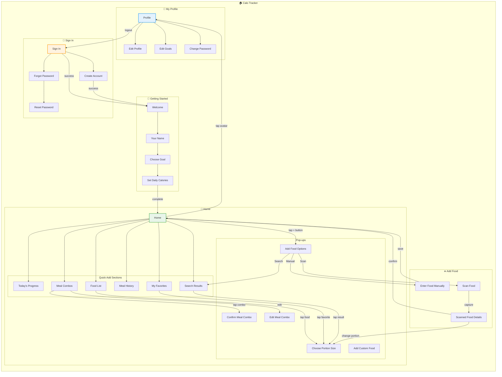

# IA Map - Base (Calo Tracker)

## Current Information Architecture



---

## Route Structure

| Route | Screen Name | Protection | Purpose |
|-------|-------------|------------|---------|
| `/` | Redirect | - | Redirects to Sign In |
| `/login` | Sign In | Public (logged out only) | User authentication |
| `/register` | Create Account | Public (logged out only) | New user registration |
| `/forgot-password` | Forgot Password | Public | Password recovery |
| `/reset-password` | Reset Password | Public | Set new password |
| `/onboarding/welcome` | Welcome | Logged in only | Onboarding start |
| `/onboarding/name` | Your Name | Logged in only | Set display name |
| `/onboarding/goal` | Choose Goal | Logged in only | Select health goal |
| `/onboarding/calories` | Set Daily Calories | Logged in only | Set daily calories |
| `/dashboard` | Home | Logged in only | **Main app screen** |
| `/profile` | Profile | Logged in only | User profile |
| `/profile/edit` | Edit Profile | Logged in only | Edit name/avatar |
| `/profile/edit-goals` | Edit Goals | Logged in only | Edit nutrition goals |
| `/profile/change-password` | Change Password | Logged in only | Change password |

---

## Object Location Mapping

| Object | Primary Location | Secondary Location(s) | Access From |
|--------|------------------|----------------------|-------------|
| **User** | Profile | Home (header) | Profile button, Sign In |
| **Food Log** | Home (Meal History) | - | Timeline cards, Today's Progress |
| **System Food** | Home (Food List, Search) | Scanned Food Details | Tiles, Search, Scan |
| **Custom Food** | Home (Search) | - | Search results |
| **Favorite** | Home (My Favorites) | - | Favorites section |
| **Meal Combo** | Home (Meal Combos) | - | Templates section |
| **Daily Summary** | Home (Today's Progress) | - | Progress ring, Macro bars |

---

## Navigation Paths

### Primary Paths

| Task | Primary Path | Alternative Path(s) |
|------|--------------|---------------------|
| Log Food (from list) | Home → Tap food → Choose portion → Confirm | Home → + button → Scan → Review → Confirm |
| Log Food (manual) | Home → + button → Enter manually → Save | Search → No results → Add custom food |
| View Progress | Home (visible immediately) | - |
| View Meal History | Home → Scroll to Meal History | - |
| Use Favorite | Home → My Favorites → Tap food → Choose portion | - |
| Use Meal Combo | Home → Meal Combos → Tap combo → Confirm | - |
| Search Food | Home → Search bar → Type → Tap result | - |
| Edit Profile | Home → Avatar → Profile → Edit Profile | - |
| Edit Goals | Home → Avatar → Profile → Edit Goals | - |

### Authentication Paths

| Action | Path |
|--------|------|
| Sign In | Sign In → Enter email & password → Home |
| Create Account | Sign In → Create Account link → Create Account → Welcome |
| Forgot Password | Sign In → Forgot link → Forgot Password → Enter email → Reset Password |
| Sign Out | Profile → Sign Out → Sign In |

---

## Screen Sections

### Home Screen Sections

```
┌─────────────────────────────────────┐
│ Header: Greeting + Profile Picture  │
├─────────────────────────────────────┤
│ Today's Progress: Ring + Macro Bars │
├─────────────────────────────────────┤
│ Quick Add Title + Search Bar        │
├─────────────────────────────────────┤
│ My Favorites (horizontal scroll)    │
├─────────────────────────────────────┤
│ Meal Combos                         │
├─────────────────────────────────────┤
│ Meal History (tabs: Today / Week)   │
├─────────────────────────────────────┤
│ Food List (recent items)            │
├─────────────────────────────────────┤
│ [+ Add Food button]                 │
└─────────────────────────────────────┘
```

### Pop-ups & Sheets

| Name | Type | Trigger |
|------|------|---------|
| Add Food Options | Bottom sheet | Tap + button |
| Choose Portion Size | Bottom sheet | Tap any food |
| Confirm Meal Combo | Bottom sheet | Tap meal combo |
| Edit Meal Combo | Bottom sheet | Edit meal combo |
| Add Custom Food | Pop-up | From Add Options or no search results |
| Confirm Sign Out | Pop-up | Tap Sign Out button |
| Notification | Toast | After logging food |
