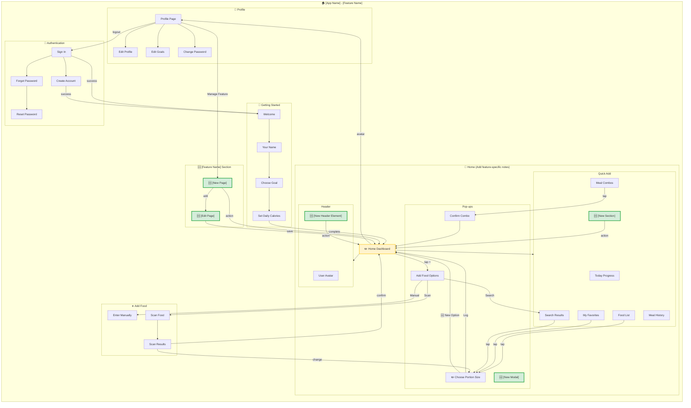

# IA Map - [Prototype Name] with [Feature Name] Support

## Updated Information Architecture with [Feature Name]



---

## Summary of Changes

### 🆕 NEW Elements

| Component | Location | Purpose |
|-----------|----------|---------|
| **[New Element 1]** | [Location] | [Purpose] |
| **[New Element 2]** | [Location] | [Purpose] |
| **[New Element 3]** | [Location] | [Purpose] |

### ✏️ MODIFIED Elements

| Component | Change | Impact |
|-----------|--------|--------|
| **[Modified Element 1]** | [Description of change] | [Impact] |
| **[Modified Element 2]** | [Description of change] | [Impact] |
| **[Modified Element 3]** | [Description of change] | [Impact] |

### Navigation Changes

| Navigation | Before | After |
|------------|--------|-------|
| [Navigation Path 1] | [Previous flow] | [New flow] |
| [Navigation Path 2] | [Previous flow] | [New flow] |
| [Navigation Path 3] | [Previous flow] | [New flow] |

### Data Model Additions

```
[New Object 1]:
├── [field 1]
├── [field 2]
└── [field 3]

[New Object 2]:
└── [field 1]

[Existing Object] (ENHANCED):
└── [new relationship/field]
```

---

## Route Structure Updates

| Route | Screen Name | Protection | Change | Purpose |
|-------|-------------|------------|--------|---------|
| `/[route]` | [Screen] | [Protection level] | 🆕 NEW | [Purpose] |
| `/[route]` | [Screen] | [Protection level] | ✏️ MODIFIED | [Purpose] |
| `/[route]` | [Screen] | [Protection level] | Unchanged | [Purpose] |

---

## Object Location Mapping Updates

| Object | Primary Location | Secondary Location(s) | Change | Access From |
|--------|------------------|----------------------|--------|-------------|
| **[Object 1]** | [Location] | [Secondary location] | 🆕 NEW | [Access path] |
| **[Object 2]** | [Location] | [Secondary location] | ✏️ MODIFIED | [Access path] |
| **[Object 3]** | [Location] | [Secondary location] | Unchanged | [Access path] |

---

## Screen Sections Updates

### [Screen Name] Sections

```
┌─────────────────────────────────────────────┐
│ [Header Section]                          │  ← [Change type]
├─────────────────────────────────────────────┤
│ [Content Section 1]                      │  ← [Change type]
├─────────────────────────────────────────────┤
│ [Content Section 2]                      │  ← [Change type]
├─────────────────────────────────────────────┤
│ [Action Section]                          │  ← [Change type]
└─────────────────────────────────────────────┘
```

### Pop-ups & Sheets (Enhanced)

| Name | Type | Trigger | Change | Purpose |
|------|------|---------|--------|---------|
| [Modal Name] | [Type] | [Trigger] | 🆕 NEW | [Purpose] |
| [Modal Name] | [Type] | [Trigger] | ✏️ ENHANCED | [Purpose] |
| [Modal Name] | [Type] | [Trigger] | Unchanged | [Purpose] |

---

## Key Features Delivered

1. **[Feature 1]** - [Description]
2. **[Feature 2]** - [Description]
3. **[Feature 3]** - [Description]
4. **[Feature 4]** - [Description]
5. **[Feature 5]** - [Description]

---

## Implementation Notes

- **[Note 1]:** [Implementation detail]
- **[Note 2]:** [Implementation detail]
- **[Note 3]:** [Implementation detail]
- **[Note 4]:** [Implementation detail]
- **[Note 5]:** [Implementation detail]

---

## Template Usage Instructions

1. **Copy this file** to your feature's outputs directory
2. **Replace placeholders** with actual feature names
3. **Add new elements** where marked with `🆕 ADD:`
4. **Modify existing elements** where marked with `✏️`
5. **Update connections** between nodes in the diagram
6. **Apply styling** using the color guide:
   - **Unchanged**: No style (default gray)
   - **Modified**: Yellow/Orange (`fill:#fff3cd,stroke:#ffc107`)
   - **New**: Green (`fill:#d4edda,stroke:#28a745`)
7. **Fill in summary tables** with actual changes
8. **Remove this instruction section** before finalizing

## Styling Color Reference

| Type | CSS Color | Hex Code | Visual |
|------|-----------|-----------|--------|
| **New (🆕)** | Light Green | `#d4edda` | 🟢 |
| **Modified (✏️)** | Light Yellow/Orange | `#fff3cd` | 🟡 |
| **Unchanged** | Default Gray | (default) | ⚪ |
| **Blue (Info)** | Light Blue | `#d1ecf1` | 🔵 |

Apply using: `style [NODE_NAME] fill:[COLOR],stroke:[STROKE],stroke-width:[WIDTH]`
